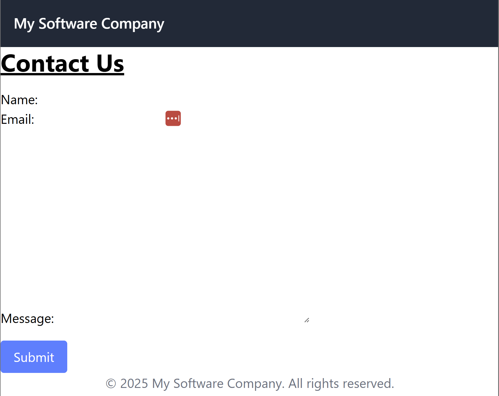
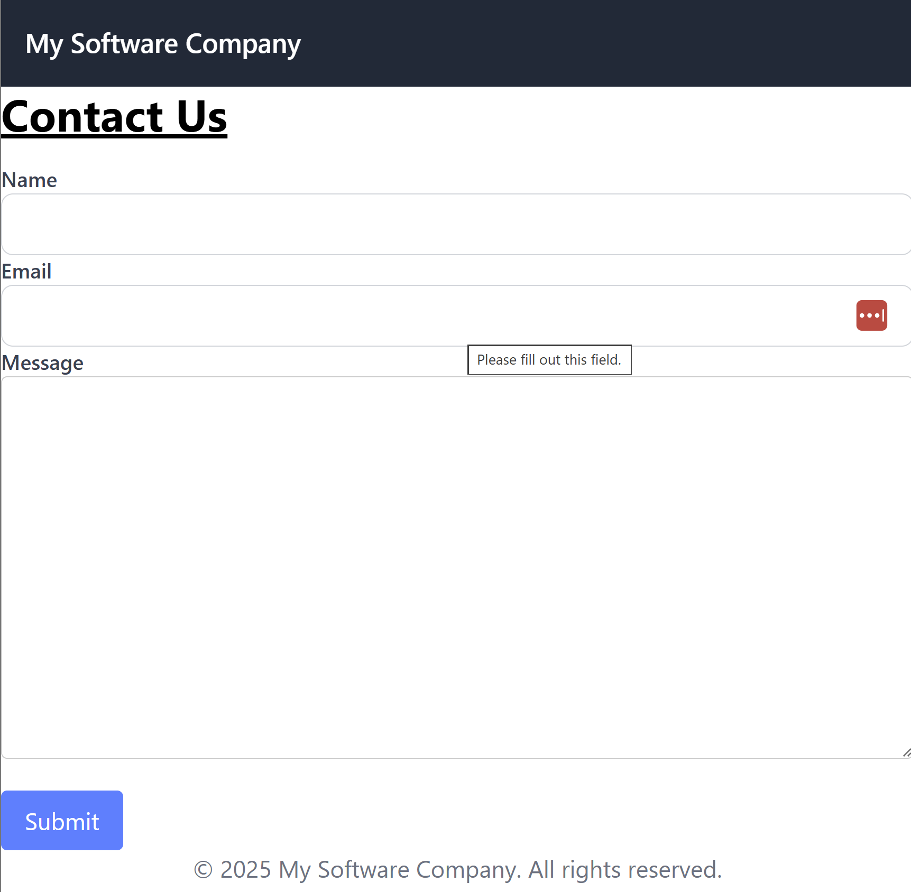
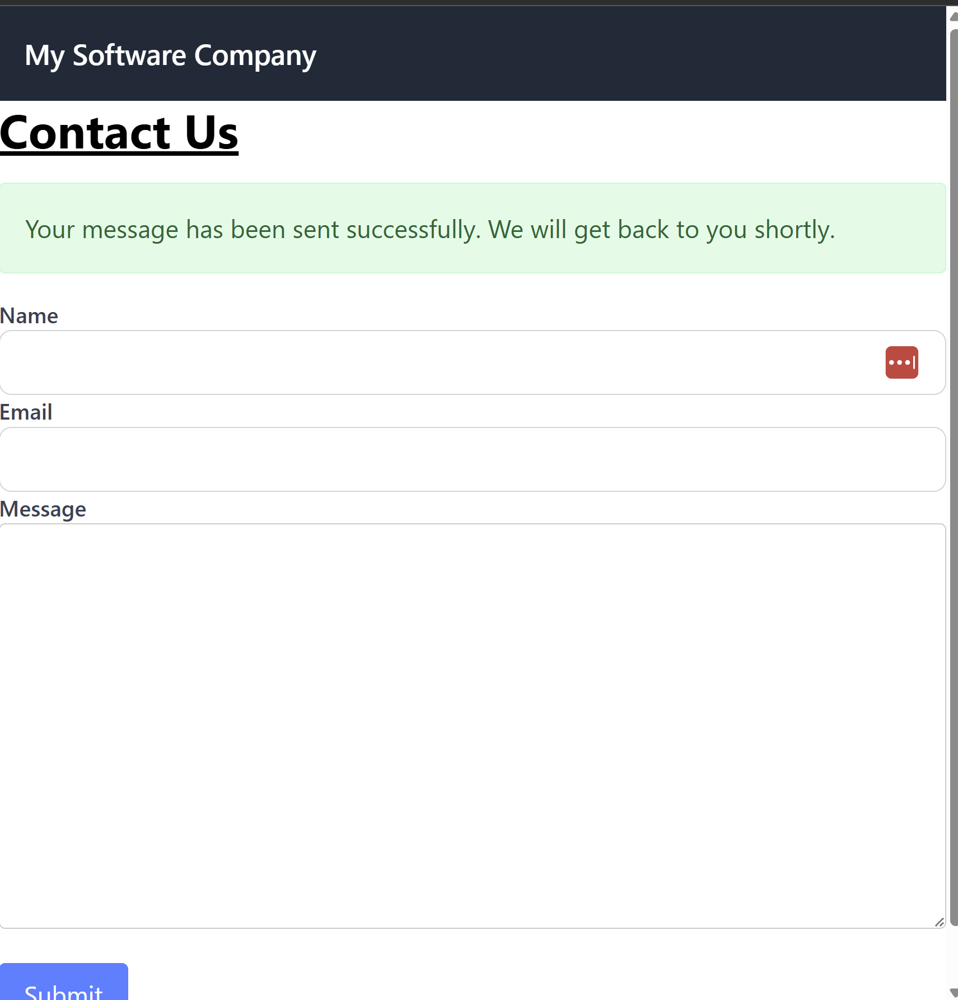
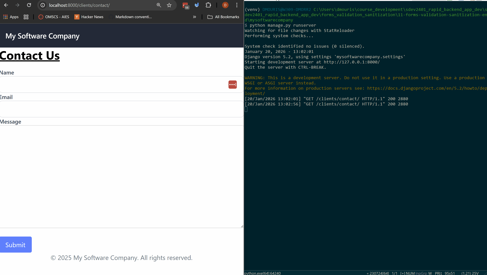
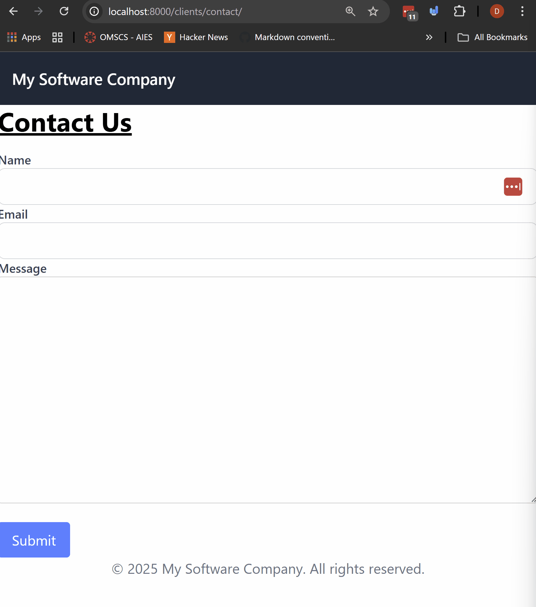

# Forms Validation and Sanitization

So far we've covered how use data in templates and views, and how to use the ORM to get and create data in the database. In this module we're going to cover how to get data from the user through forms, and how to validate and sanitize that data before saving it to the database.

This is crucial part for web applications for multiple reasons. First is that this is where you will build trust with your users. If your forms are not secure, or if they don't work properly, users will not trust your application. Second is that this is where most security vulnerabilities occur. If you don't validate and sanitize user input, you could be opening your application up to SQL injection attacks, cross-site scripting attacks, and other types of attacks.

## Prerequisites
- Create a new virtual environment and install the packages from the `requirements.txt` file.
- Run the migrations to create the database schema.


## Steps

We're going to build a contact us form inside the `clients` app that will allow users to send a message to the company. We'll cover how to create a form, render it in a template, handle the form submission in the view, validate and sanitize the data from the form, and send an email using the data from the form.

#### 1. Let's create a form in the `clients` app.

We're going to create a simple contact form that will send an email to the company when submitted.

- Create a forms.py file in the clients app.
```python
from django import forms

class ContactForm(forms.Form):
    name = forms.CharField(max_length=100, required=True)
    email = forms.EmailField(required=True)
    message = forms.CharField(widget=forms.Textarea, required=True)
```
Let's breakdown what we're doing here.
- We import the forms module from django.
- We create a ContactForm class that inherits from forms.Form.
- We define three fields: name, email, and message.

This is a fundamental form that we'll be using in our contact us page.
We're going to use this form to clean and validate the data that user submits

Note: If you want to take a look at the [docs click here](https://docs.djangoproject.com/en/5.2/topics/forms/#building-a-form-in-django)

#### 2. Let's take a look at the view in `clients/views.py` that will handle the form submission, let's also add it to the `urls.py` file.
Let's use this form in a view to pass the form into the template, we'll handle the form submission in future steps here.

```python
# ...other imports...
from django.shortcuts import render
from .forms import ContactForm

# Create the contact form here.
def contact_us(request):
    # this handles get request and displays the form to the user.
    if request.method == "GET":
        form = ContactForm()
        return render(request,
            "clients/contact_us.html",
            {"form": form}
        )
    # form submission will be handled in future steps.
```

So let's talk about what we're doing here.
- We import the ContactForm from the forms module.
- We create a contact_us view that handles GET requests.
- If the request method is GET, we create an instance of the ContactForm and pass it to the template.

We haven't created the template yet so let's create that next, first let's add the url pattern for this view in the `clients/urls.py` file.

```python
from .views import (
    list_companies, company_detail, employees_search_results, contact_us
)
# ... other url patterns ...
    path('contact/', contact_us, name='contact_us'),  # New URL pattern for contact form
```

#### 3. Let's create the template to render the form.

Create a `contact_us.html` file in the `clients/templates/clients` directory.

```html



<div class="max-w-2xl mx-auto">
    <h1 class="text-3xl font-bold underline">
        <!-- title here-->
        Contact Us
    </h1>
    <!-- Add the CSRF token for security -->
    <form method="post" class="mt-4">
        
        <!-- Render the form fields -->
        {{ form.as_p }}
        <button type="submit" class="mt-4 px-4 py-2 bg-blue-500 text-white rounded">
            Submit
        </button>
    </form>
</div>

```

This the most rudimentory way to render a form in Django, Let's talk about what's happening here.
- We create a form that uses the `post` method to submit the data. We use this so that the user's data is not exposed in the URL.
- We add the CSRF token for security, this is required for all POST forms in Django.
- We render the form fields using `{{ form.as_p }}`. This will render the form fields as paragraphs.
- You folks learned last semester in JavaScript about hte default behaviour of forms wanting to submit to the server and reload the page. That's exactly what will happen here when the user clicks the submit button.

Right now our form looks like the image below.


There's a few issues with our form now.
- This doesn't quite look great.
- There's no handling of the post request when the form is submitted.

#### 4. Let's improve the form rendering and handle the form submission.

Let's edit the view so that our form template looks a bit better.

```html



<div class="max-w-2xl mx-auto">
    <h1 class="text-3xl font-bold underline">
        <!-- title here-->
        Contact Us
    </h1>
    <!-- Add the CSRF token for security -->
    <form method="post" class="mt-4">
        
        <!-- Render the form fields explicitly -->
        

            <label for="{{ field.id_for_label }}" class="block text-sm font-medium text-gray-700">
                {{ field.label }}
            </label>
            {{ field }}
            
                <p class="text-sm text-red-500 mt-1">{{ field.errors|striptags }}</p>
            
            </div>
        

        <button type="submit" class="mt-4 px-4 py-2 bg-blue-500 text-white rounded">
            Submit
        </button>
    </form>
</div>

```
In the above we changed the way we render the form fields so that we can be a bit more granular with the styling, markup and error handling.
- We loop through each field in the form and render the label and field explicitly.
- We also check if there are any errors for the field and display them below the field.
- This gives us more control over the rendering of the form.

Note: we also adda bit of styling in the `templates/base.html` file to make the form look a bit better.

Now our form looks like below.


#### 5. Let's handle the form submission in the view and update the template to show a success message.
Now if you enter some data into the form and click submit You'll see you get a 500 error. This is because we haven't handled the POST request in the view yet, let's do that now.

```python
# ...other imports...
from django.core.mail import send_mail
from .forms import ContactForm

def contact_us(request):
    if request.method == "GET":
        form = ContactForm()
        return render(request,
            "clients/contact_us.html",
            {"form": form}
        )
    # handl the post submission here!
    elif request.method == "POST":
        form = ContactForm(request.POST)
        # if the form is valid then process the data.
        if form.is_valid():

            # Process the cleaned data
            name = form.cleaned_data['name']
            email = form.cleaned_data['email']
            message = form.cleaned_data['message']

            # Send an email to some_admin_account@test.com in the next step.

            # in the future we can redirect to a thank you page.
            return render(request,
                "clients/contact_us.html",
                {"form": ContactForm(), "success": True}
            )
        else:
            # this is going to rerender the form with error messages
            # as it's not quite valid here.
            return render(request,
                "clients/contact_us.html",
                {"form": form}
            )

# ... other views below ...
```
In the code above we're handling the POST request when the form is submitted. We'll be setting up an email backend in the next step to send an email but let's take a detailed look at what is happening here.
1. We check if the request method is POST.
2. We create an instance of the ContactForm with the submitted data `request.POST`.
3. We check if the form is valid using `form.is_valid()` this returns a boolean.
   1. If `True` then the `form.cleaned_data` dictionary will contain the validated and sanitized data from the form. The `cleaned_data` attribute is only available after calling `is_valid()` and is "validated" and "sanitized" meaning that the data has been checked against the field types and any custom validation rules defined in the form.
   2. If `False` then the `form.errors` dictionary will contain the error messages for each field.
4. If the form is valid we extract the cleaned data and in the next step we'll send an email using this data.
5. If the form is not valid we simply rerender the form with the error messages.

You'll now notice that the form will just show the same page again when you submit it. Let's update the template to show a success message when the form is submitted successfully.

In the template `contact_us.html` update the code to show a success message.

```html



<div class="max-w-2xl mx-auto">
    <h1 class="text-3xl font-bold underline">
        Contact Us
    </h1>
    <!-- Show the success message -->
    
    <div class="mt-4 p-4 bg-green-100 text-green-800 border border-green-200 rounded">
        Your message has been sent successfully. We will get back to you shortly.
    </div>
    
    <!-- rest of the form below here. -->

</div>

```
This now will show a success message as shown below when the form is submitted successfully.


#### 6. Let's set up a testing email backend and send an email when the form is submitted.
In the `settings.py` file of the project, add the following email configuration for development.

```python
# Email configuration for development (console backend)
EMAIL_BACKEND = "django.core.mail.backends.console.EmailBackend"
```
There's a lot of different email backends that you can use in django to send emails for the development environment we use the console backend which simply prints the email to the console instead of sending it. This is useful for testing purposes.

Note: here's a list of providers you could use for your email backend in production.
- [SendGrid](https://sendgrid.com/)
- [Mailgun](https://www.mailgun.com/)
- [Postmark](https://postmarkapp.com/)
- [Amazon SES](https://aws.amazon.com/ses/)

Let's update the `contact_us` view in `clients/views.py` to send an email when the form is submitted successfully.

```python
def contact_us(request):
    # ... get request handling code ...
    # handl the post submission here!
    elif request.method == "POST":
        form = ContactForm(request.POST)
        # if the form is valid then process the data.
        if form.is_valid():

            # Process the cleaned data
            name = form.cleaned_data['name']
            email = form.cleaned_data['email']
            message = form.cleaned_data['message']

            # Send an email to some_admin_account@test.com in the next step.
            send_mail(
                subject=f"New contact us message from {name}",
                message=message,
                from_email=email,
                recipient_list=["some_admin_account@test.com"],
            )
            # in the future we can redirect to a thank you page.
            return render(request,
                "clients/contact_us.html",
                {"form": ContactForm(), "success": True}
            )
        else:
            # this is going to rerender the form with error messages
            # as it's not quite valid here.
            return render(request,
                "clients/contact_us.html",
                {"form": form}
            )
# ... other views below ...
```
Now this will send an email to "some_admin_account@test.com" when the form is submitted successfully. Since we're using the console email backend, the email will be printed to the console instead of being sent. Let's take a look below



#### 7. Let's add a bit more validation to the form.
Let's add a custom validation to the contact form to ensure that the message is at least 10 characters long and the name is at least 2 characters long.

Open the `forms.py` file in the `clients` app and update the `ContactForm` class as follows.

```python
from django import forms

class ContactForm(forms.Form):
    name = forms.CharField(max_length=100, required=True)
    email = forms.EmailField(required=True)
    message = forms.CharField(widget=forms.Textarea, required=True)

    # Custom validation for the name field
    # the <fieldname> method is used to add custom validation to a field.
    def clean_name(self):
        name = self.cleaned_data.get('name')
        if len(name) < 2:
            # this will raise an validation error if the name is less than 2 characters long.
            raise forms.ValidationError("Name must be at least 2 characters long.")
        return name

    # Custom validation for the message field
    def clean_message(self):
        message = self.cleaned_data.get('message')
        if len(message) < 10:
            raise forms.ValidationError("Message must be at least 10 characters long.")
        return message

```
In the code above we added two custom validation methods `clean_name` and `clean_message` to the `ContactForm` class.
- The `clean_<fieldname>` method is used to add custom validation to a field. Just a note you can also use `validate_<fieldname>` method but the `clean_<fieldname>` method is more commonly used as it allows you to modify the cleaned data if needed.
    - Note: You can also add cross-field validation by overriding the `clean` method of the form or the `validate` method of the form.
    - We'll use this in future form examples.
- If the validation fails, we raise a `forms.ValidationError` with an appropriate error message.
- You can see if the validation passes we just return the cleaned data.

This validation is called when we call the `is_valid()` method in the view in `clients/views.py`. If the validation fails, the error messages will be added to the `form.errors` dictionary and will be displayed in the template.

Let's take a look at the validation in action below.



## Challenge/Exercise
Create a page for users to sign up for a newsletter.
1. Create a form with fields for name and email.
2. Create a view named `newsletter` to handle the form submission at the url path `/newsletter/`.
3. Create a template to render the form called `newsletter_signup.html`.
4. Validate and sanitize the data from the form.
5. Send a confirmation email to the user when they sign up.

Stretch Goal: Save the newsletter signups to a NewsletterSignup model in the database (we'll cover models in a future module).

## Conclusion

In this module we covered how to create a form in Django, render it in a template, handle the form submission in the view, validate and sanitize the data from the form, and send an email using the data from the form.
