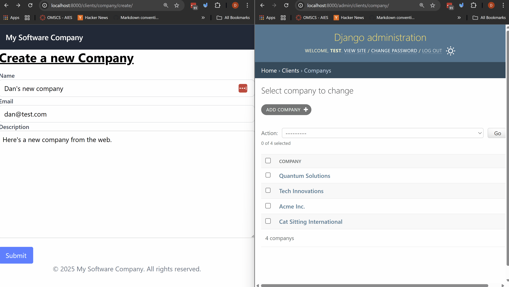
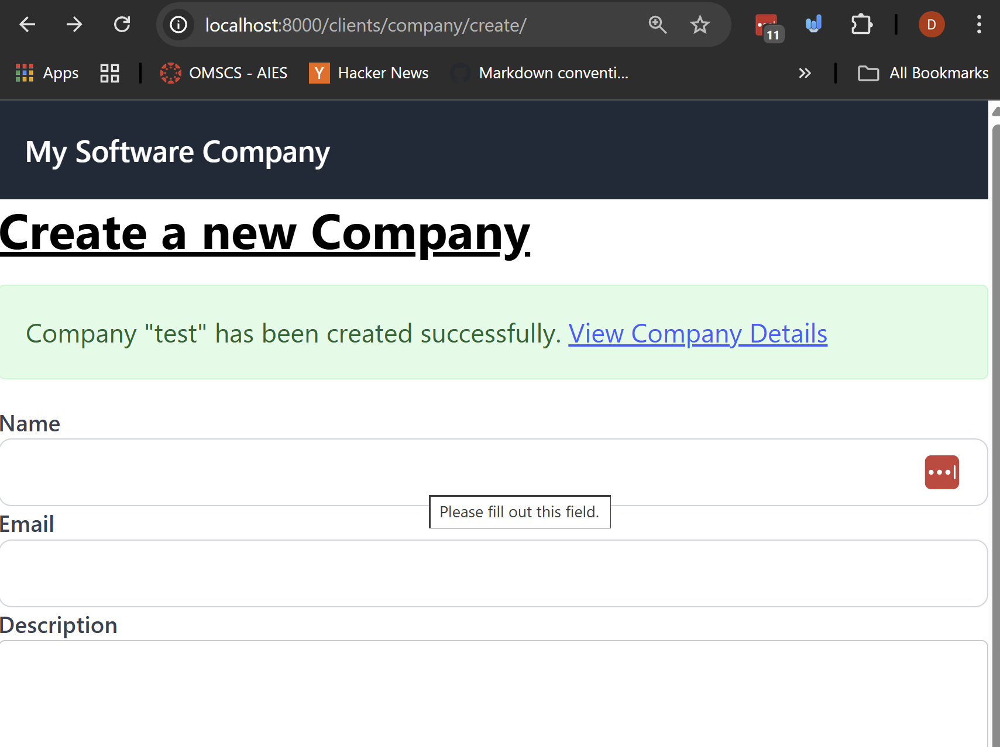
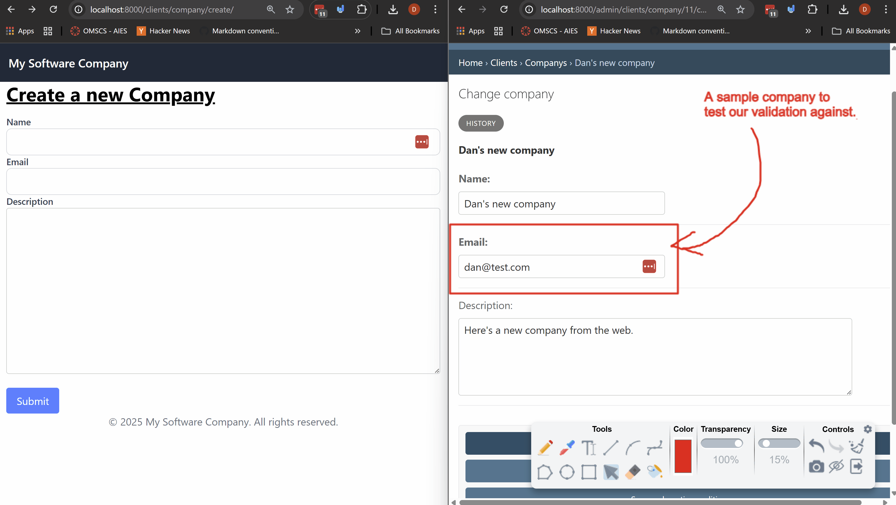

# Forms Validation and Sanitization

Last example we worked on creating a contact us form, validating and sanitizing the data, and sending an email.

In this example we're going to allow users to create companies using a model form, and validate and sanitize the data before saving it to the database.

## Prerequisites
- Create a new virtual environment and install the packages from the `requirements.txt` file.
- Run the migrations to create the database schema.

## Steps

We're going to follow similar steps as before, so first create the form, then render it in a template, handle the form submission in the view, validate and sanitize the data from the form, and finally save the data to the database (this last part is new).

#### 1. Let's create a form for creating companies inside of `clients/forms.py`.

In Django, there are two main types of forms: regular forms and model forms. Model forms are tied to a specific model and can be used to create and update records in the database.

Model forms are great because you can leverage the model's field definitions and validation rules, reducing the amount of code you need to write, and ensuring consistency between your forms and models.

```python
from django import forms

from .models import Company

class CompanyForm(forms.ModelForm):
    # the inner Meta class tells django which model to use and which fields to include in the form
    class Meta:
        model = Company
        fields = ['name', 'email', 'website']
        # note in our model we also have created_at and updated_at fields, but we don't need to include them in the form since they are automatically set by django
```
So let's break down what we just did here.
- The `CompanyForm` class inherits from `forms.ModelForm`, indicating that this is a model form.
- The inner `Meta` class specifies the model to use (`Company`) and the fields to include in the form (`name`, `email`, `website`).
  - This is required for model forms to know which model to work with, and which fields to include in the form.
    - Note that we didn't include the `created_at` and `updated_at` fields since they are automatically managed by Django.
- Django will automatically generate the appropriate form fields based on the model field types, and will also apply any validation rules defined in the model.

#### 2. Let's create a view and template to render the form inside `clients/views.py` and hook it up to a url.

```python
from django.shortcuts import render, redirect
from .forms import CompanyForm


def create_company(request):
    form = CompanyForm()
    return render(request,
        "clients/create_company.html",
        {"form": form}
    )
```
- Here we're just creating a view function called `create_company` that will render the form in a template called `create_company.html`.
- Let's create that template in `clients/templates/clients/create_company.html`.
```html



<div class="max-w-2xl mx-auto">
    <h1 class="text-3xl font-bold underline">
        Create a new Company
    </h1>
    <form method="post" class="mt-4">
        <!-- Add the CSRF token for security -->
        
        <!-- Render the form fields -->
            
            <div>
            <label for="{{ field.id_for_label }}" class="block text-sm font-medium text-gray-700">
                {{ field.label }}
            </label>
            {{ field }}
            
                <p class="text-sm text-red-500 mt-1">{{ field.errors|striptags }}</p>
            
            </div>
        
        <button type="submit" class="mt-4 px-4 py-2 bg-blue-500 text-white rounded">
            Submit
        </button>
    </form>
</div>


```
- You can see here that we're using the same structure as we did for our contact us form. We could style it differently if we wanted to, but for now this is fine.

Let's hook up the view to a url in `clients/urls.py`.

```python
from django.urls import path
from .views import create_company
urlpatterns = [
    # ... other urls ...
    path('company/create/', create_company, name='create_company'),
]
```

#### 3. Now let's handle the form submission, validate and sanitize the data and then save it to the database.

Let's update our `create_company` view to handle POST requests, validate and sanitize the data, and save it to the database using our model form.

```python
# ... other imports ...

from .models import Company, Employee
from .forms import ContactForm, CompanyForm

def create_company(request):
    if request.method == "POST":
        form = CompanyForm(request.POST)
        # check if the form is valid.
        if form.is_valid():
            # Save the new company to the database
            # this uses the clean data from the form to create a new company
            form.save()
            # get the newly created company instance
            company = form.instance
            # pass the new company to the template
            return render(request,
                "clients/create_company.html",
                {"form": CompanyForm(), "new_company": company}
            )
        else:
            return render(request,
                "clients/create_company.html",
                {"form": form}
            )
    if request.method == "GET":
        form = CompanyForm()
        return render(request,
            "clients/create_company.html",
            {"form": form}
        )

# ... other views ...
```
Let's talk about what we did here and what is happening.
- First we check if the request method is POST. If it is, we create an instance of the `CompanyForm` with the data from the request.
- Then we call the `is_valid()` method on the form instance. This method checks if the data is valid according to the validation rules defined in the model and the form.
- If the form is valid, we call the `save()` method on the form instance. This method saves the new company to the database using the cleaned data from the form.
  - We can override the `save()` method if we want to do something custom before saving, but in this case we don't need to.
  - If the form is not valid, we render the form again with the errors displayed.

Note: in class we'll step through this with a `breakpoint()` to see how the data is being processed.

#### 4. Testing our Form and seeing the company save to our database.

Let's navigate to `http://localhost:8000/clients/company/create/` in our browser and test out our form.

- We're also going to open the admin `http://localhost:8000/admin/clients/company/` to see the company being created in the database.

Let's take a look at the form in action below.


You can see that we were able to create a new company using our form, and the data was validated and sanitized before being saved to the database, but let's

#### 5. Let's Add a bit of success feedback to the user and a link to the newly created company.

Note that in the view above we are passing the newly created company to the template as `new_company` if the form was successfully submitted.
- We're going to check if `new_company` is in the template context, and if it is, we'll show a success message with a link to the newly created company's detail page.
- Take a look at the view inside the `if form.is_valid():` block above to see how we are passing the `new_company` to the template.
```html



<div class="max-w-2xl mx-auto">
    <!--... title ...-->
    <!-- Show the success message -->
    
    <div class="mt-4 p-4 bg-green-100 text-green-800 border border-green-200 rounded">
        Company "{{ new_company.name }}" has been created successfully.
        <a href="" class="text-blue-600 underline">
            View Company Details
        </a>
    </div>
    

    <!-- ... form below ...-->
</div>

```
Let's talk about the `` tag here.
- The `` tag generates a URL for the `company_detail` view, passing the `id` of the newly created company as an argument.
  - The `company_detail` is the name of the url patern we defined in `clients/urls.py` for the company detail view. This takes a single parameter `company_id`.
  - The `new_company.id` is the id of the newly created company instance.

Here's what it looks like in action on creating a company named "Test"



#### 6. Let's make some validation to our form fields here.

We're going to add some custom validation to our `CompanyForm` to ensure that the email is unique and the company name is at least 3 characters long.
- We're going to do field level validation using the `clean_<fieldname>` method, but we're also going to add some cross field validation using the `clean()` method as well, so we can see both techniques.

Open up `clients/forms.py` and update the `CompanyForm` as follows:

```python
from django import forms
from .models import Company

class CompanyForm(forms.ModelForm):
    class Meta:
        model = Company
        fields = ['name', 'email', 'website']

    def clean_name(self):
        name = self.cleaned_data.get('name')
        if len(name) < 3:
            raise forms.ValidationError("Company name must be at least 3 characters long.")
        return name

    def clean(self):
        # note the line below calls the parent class's clean method to get the cleaned data remember this is from inheritence.
        cleaned_data = super().clean()
        email = cleaned_data.get('email')
        # we can search our database
        if Company.objects.filter(email=email).exists():
            raise forms.ValidationError("A company with this email already exists.")
            # note you can also use `self.add_error('email', 'A company with this email already exists.')` to add the error to a specific field instead of the whole form.

        # check for banned words.
        name = cleaned_data.get('name', '')
        description = cleaned_data.get('description', '')
        forbidden_words = ['spam', 'fake', 'scam']
        for word in forbidden_words:
            if word in description.lower() or word in name.lower():
                raise forms.ValidationError(f"The company contains a forbidden word: {word}")


        return cleaned_data
```

Let's talk about the two validation methods here that we just added.
1. `clean_name(self)`: This method is used for field-level validation for the `name` field. It checks if the length of the name is at least 3 characters long. If not, it raises a `ValidationError`. We've seen this in the previous example.
2. `clean(self)`: This method is used for cross-field validation, or just overall validation of the form. This will raise a form level error that is not tied to a specific field, this is a called a non-field error.
    - We first call the parent class's `clean()` method to get the cleaned data.
    - Then we check if a company with the same email already exists in the database. If it does, we raise a `ValidationError`. This is powerful because it allows us to validate data against existing records in the database, which is something we haven't done before.
    - Finally, we check if the name or description contains any forbidden words. If it does, we raise a `ValidationError`.

To render the form level or "non-field" errors in the template, we can add the following code snippet to our template above the form rendering loop.

```html
    <!-- form fields above. -->
    
    <div class="mb-4 p-4 bg-red-100 text-red-800 border border-red-200 rounded">
        <ul>
            
            <li>{{ error }}</li>
            
        </ul>
    </div>
    
    <!-- Button of the form. -->
```
This will display the errors that were raised in the `clean()` method at the below the fields and above the submit button.

#### 7. Let's test our validation in action.

Navigate to `http://localhost:8000/clients/company/create/` in your browser and try to create companies that violate the validation rules we just added.

You can see how the non field errors are displayed above the submit button, and the field level errors are displayed below the respective fields.

## Challenge/Exercise

Challenge 1: Create a validation on the description field to ensure that it's at least 30 characters long.

Challenge 2: Add a new field to the `Company` model called `phone_number`, and add validation to ensure that it's a valid phone number format (e.g., 10 digits).
- Note you'll have to make the migrations and apply them to the database as well to do this.
- Update the form, view, and template accordingly to handle this new field.

Challenge 3: Create a view with the url `/clients/role/create/` to create new `Role` instances using a model form, and add validation that the role is at least 4 characters long.
- Update the template to show success messages and errors as we did in the company form.


## Conclusion

In this example we leanered how to create a model form in Django, render it in a template, handle form submissions in the view, validate and sanitize the data, and save it to the database. We also covered both field-level and cross-field validation techniques.

In future classes we'll cover updating existing records using model forms, and more advanced validation techniques.
