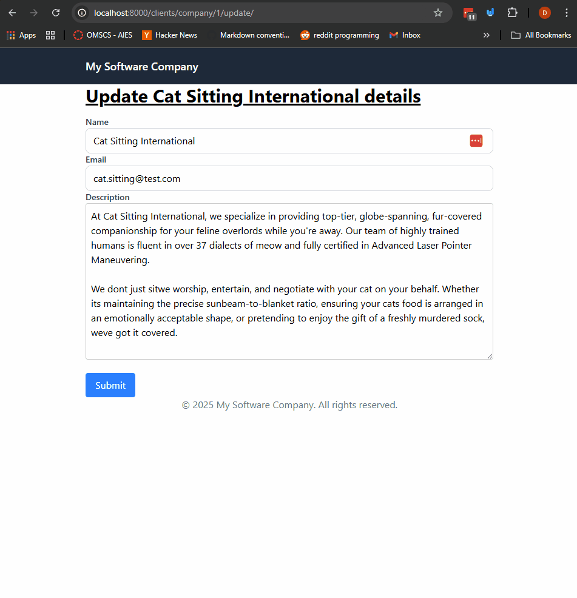
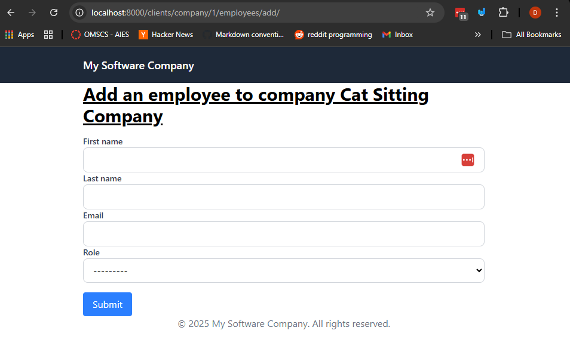
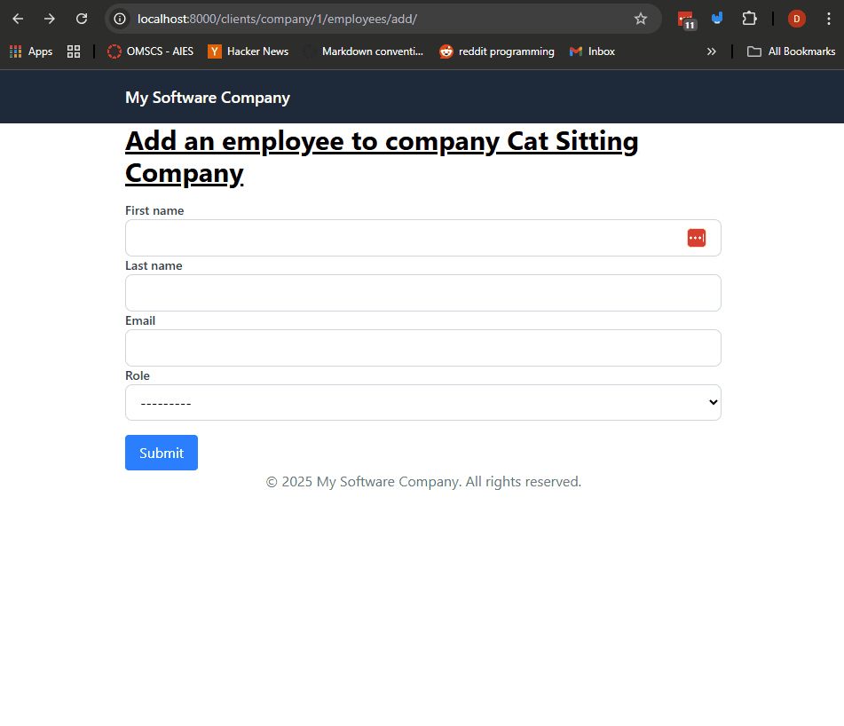
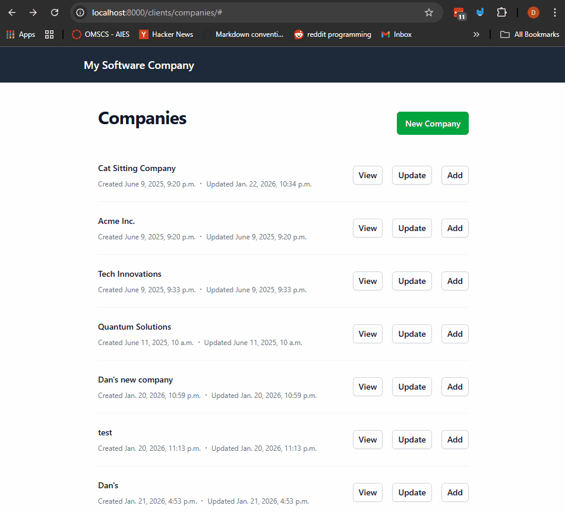

# Forms Validation and Sanitization - Using Model Forms to Update Existing Records

So far we've learned about using regular and model forms. Last example we learned how to create new records using model forms. In this section we will learn how to update existing records using model forms, along with validation and sanitization.

## Prerequisites
- Create a new virtual environment and install the packages from the `requirements.txt` file.
- Run the migrations to create the database schema.

## Steps

We're going to extend the previous example where we're going to create an update form for an existing model record. We're also going to create a view to add new employees to a specific company, so we can practice some more as well.

#### 1. Let's create a view to with the abiaility to update the existing company record.
Inside of `clients/views.py` create a new view named `update_company` that takes a `company_id` parameter.
- In this view we're also going to use the `get_object_or_404` shortcut to retrieve the existing company record from the database.

```python
from django.shortcuts import render, get_object_or_404

from .models import Company
from .forms import CompanyForm

def update_company(request, company_id):
    company = get_object_or_404(Company, id=company_id)
    if request.method == "GET":
        form = CompanyForm(instance=company)
        return render(request,
            "clients/update_company.html",
            {
                "company": company,
                "form": form
            }
        )
```
Let's talk about what this code does:
- We use the `get_object_or_404` shortcut to retrieve the existing company record from the database using the provided `company_id`.
  - Again, if no record is found with that ID, a 404 error page is returned.
- If the request method is `GET`, we create an instance of the `CompanyForm` using the existing company record by passing it to the `instance` parameter.
- We're passing the `form` and the `company` object to the template context so we can use it in the template.

Next let's create a template named `update_company.html` inside of the `clients/templates/clients/` directory.
- This is going to be similar to the `create_company.html` template we created before, in the future we can refactor this to avoid code duplication but for now let's just create a new template (more on this later.)
```html



<div class="max-w-2xl mx-auto">
    <h1 class="text-3xl font-bold underline">
        Update {{ company.name }} details
    </h1>

    <form method="post" class="mt-4">
        <!-- Add the CSRF token for security -->
        
        <!-- Render the form fields -->
            
            <div>
            <label for="{{ field.id_for_label }}" class="block text-sm font-medium text-gray-700">
                {{ field.label }}
            </label>
            {{ field }}
            
                <p class="text-sm text-red-500 mt-1">{{ field.errors|striptags }}</p>
            
            </div>
        
        <!-- Non field errors -->
        
        <div class="mb-4 p-4 bg-red-100 text-red-800 border border-red-200 rounded">
            <ul>
                
                <li>{{ error }}</li>
                
            </ul>
        </div>
        

        <button type="submit" class="mt-4 px-4 py-2 bg-blue-500 text-white rounded">
            Submit
        </button>
    </form>
</div>


```

This is pretty great because now we're just reusing functionality from the form that was for creating new records, but now we're using it to update existing records. Less code to write and maintain!

#### 2. Let's add the view to the `urls.py` file so we can access it via a URL.
In the `clients/urls.py` file add a new URL pattern for the `update_company` view.
```python
from .views import (
    # ... other views ...
    update_company
)
urlpatterns = [
    # ... other paths ...
    path('company/<int:company_id>/update/', update_company, name='update_company'),
    # ... other paths ...
]
```

Now if you go to the page we can update an existing company record by going to the URL `/company/<company_id>/update/` where `<company_id>` is the ID of the company you want to update. Let's go to `http://localhost:8000/company/1/update/` to update the company with ID 1. You should see something like this:


#### 3. Let's update the view to handle the `POST` request and save the updated data.
In the `update_company` view inside of `clients/views.py` add the following code to

```python
def update_company(request, company_id):
    company = get_object_or_404(Company, id=company_id)
    if request.method == "GET":
        form = CompanyForm(instance=company)
        return render(request,
            "clients/update_company.html",
            {
                "company": company,
                "form": form
            }
        )
    if request.method == "POST":
        form = CompanyForm(request.POST, instance=company)
        if form.is_valid():
            form.save()

            updated_company = form.instance
            return render(request,
                "clients/update_company.html",
                {
                    "form": CompanyForm(instance=updated_company),
                    "company": company,
                    "success": True
                }
            )
        else:
            return render(request,
                "clients/update_company.html",
                {"form": form}
            )
```
Again let's talk about what this code does:
- If the request method is `POST`, we create an instance of the `CompanyForm` using the submitted data (`request.POST`) and the existing company record by passing it to the `instance` parameter.
- We check if the form is valid using `form.is_valid()` (just like before).
- If the form is valid, we save the updated data back to the database using `form.save()`.
- After saving, we render the same template with a fresh form instance pre-filled with the updated data and a success message.

Let's update the template `update_company.html` to show a success message when the update is successful.
```html
<!-- Title -->
    
    <!-- Show the success message -->
    
    <div class="mt-4 p-4 bg-green-100 text-green-800 border border-green-200 rounded">
        Company "{{ company.name }}" updated successfully.
        <a href="" class="text-blue-600 underline">
            View Company Details
        </a>
    </div>
    
    <!-- rest of the form -->
```
- This code checks if the `success` variable is present in the template context. If it is, it displays a success message indicating that the company was updated successfully, along with a link to view the updated company details.

To also get this working properly let's update our `CompanyForm` in `clients/forms.py` and remove the check to see if a company exists. Remove the following lines from the `clean` method.
```python
        email = cleaned_data.get('email')
        # we can search our database
        if Company.objects.filter(email=email).exists():
            raise forms.ValidationError("A company with this email already exists.")
            # note you can also use `self.add_error('email', 'A company with this email already exists.')` to add the error to a specific field instead of the whole form.
```
- Now we can successfully update an existing company record without running into validation issues about the email already existing (since it's the same record we're updating.)

Let's take a look what this looks like.


#### 4. Let's Render a Form to add new employees to a specific company.

To review, practice and add a bit more functionality let's create a form to add new employees to a specific company.

First let's create the form inside of `clients/forms.py` which is going to be based on the `Employee` model.
- Take a look at the `Employee` model inside of `clients/models.py` to see what fields are available, you'll see that we have `first_name`, `last_name`, `email`, `role` and a foreign key to the `Company` model.
- We're not going to add any custom validation for now just the basic form.
```python
from django import forms
from .models import Company, Employee

class EmployeeForm(forms.ModelForm):
    class Meta:
        model = Employee
        fields = ['first_name', 'last_name', 'email', 'role']
```
In the code above we created a new `EmployeeForm` class that inherits from `forms.ModelForm`. We specified the `Employee` model and the fields we want to include in the form.

An Important note here is that we did not include the `company` field in the form because we're going to set that in the view based on the company we're adding the employee to based on the URL.

Second let's create the view to handle adding a new employee to a specific company inside of `clients/views.py`.
```python
# ... other imports ...
from django.shortcuts import render, get_object_or_404
# import all models and forms at the top of the file
from .models import Company, Employee
from .forms import ContactForm, CompanyForm, EmployeeForm

def company_add_employee(request, company_id):
    company = get_object_or_404(Company, id=company_id)

    if request.method == "GET":
        form = EmployeeForm()
        return render(request,
            "clients/add_employee.html",
            {
                "company": company,
                "form": form
            }
        )
# ... rest of the forms ...
```
Let's take a look at what we're doing here.
- We created a new view named `company_add_employee` that takes a `company_id` parameter, this is will be defined in the `path` in the `urls.py` file.
- We use the `get_object_or_404` shortcut to retrieve the existing company record from
the database using the provided `company_id`.
- If the request method is `GET`, we create an instance of the `EmployeeForm` and render the `add_employee.html` template, passing the form and company object to the template context.

We'll add the `POST` handling code after we create the template and add the url.

Third let's create the template named `add_employee.html` inside of the `clients/templates/clients/` directory.
```html



<div class="max-w-2xl mx-auto">
    <h1 class="text-3xl font-bold underline">
        Add an employee to company {{ company.name }}
    </h1>

    <form method="post" class="mt-4">
        <!-- Add the CSRF token for security -->
        
        <!-- Render the form fields -->
            
            <div>
            <label for="{{ field.id_for_label }}" class="block text-sm font-medium text-gray-700">
                {{ field.label }}
            </label>
            {{ field }}
            
                <p class="text-sm text-red-500 mt-1">{{ field.errors|striptags }}</p>
            
            </div>
        
        <!-- Non field errors -->
        
        <div class="mb-4 p-4 bg-red-100 text-red-800 border border-red-200 rounded">
            <ul>
                
                <li>{{ error }}</li>
                
            </ul>
        </div>
        

        <button type="submit" class="mt-4 px-4 py-2 bg-blue-500 text-white rounded">
            Submit
        </button>
    </form>
</div>


```

Fourth let's add the URL pattern for the `company_add_employee` view inside of `clients/urls.py`.
```python
from django.urls import path
from .views import (
    # ... other views ...
    company_add_employee
)

urlpatterns = [
    # ... other paths ...
    path('company/<int:company_id>/employees/add/', company_add_employee, name='company_add_employee'),
    # ... other paths ...
]

```

You should see something like this when you go to `http://localhost:8000/company/1/employees/add/` to add an employee to the company with ID 1.



#### 5. Let's handle the `POST` request in the `company_add_employee` view to save the new employee.

As you saw in the Model we have the field `company` as a foreign key to the `Company` model, that we didn't include in the model form `EmployeeForm`. So in the view we need to set that field before saving the new employee record.
- Note that we're getting the employee from the request (based on the URL parameter) and setting it on the new employee record before saving.

Let's update the `company_add_employee` view inside of `clients/views.py` to handle the `POST` request.
```python

def company_add_employee(request, company_id):
    company = get_object_or_404(Company, id=company_id)

    # ... get request handling code ...
    if request.method == "POST":
        form = EmployeeForm(request.POST)
        if form.is_valid():
            # Create a new employee instance but don't save to the database yet
            new_employee = form.save(commit=False)
            # Assign the company to the new employee
            new_employee.company = company
            # Now save the employee to the database
            new_employee.save()

            return render(request,
                "clients/add_employee.html",
                {
                    "form": EmployeeForm(),
                    "company": company,
                    "employee": new_employee,
                    "success": True
                }
            )
        else:
            # this is to render errors of course.
            return render(request,
                "clients/add_employee.html",
                {
                    "form": form,
                    "company": company
                }
            )
```

Let's also add a message to the template `add_employee.html` to show when the employee is added successfully.
```html
    <!-- Title -->
    
    <div class="mt-4 p-4 bg-green-100 text-green-800 border border-green-200 rounded">
        Employee "{{ employee.first_name }} {{ employee.last_name }}" added successfully to {{ company.name }}.
        <a href="" class="text-blue-600 underline">
            View Company Details
        </a>
    </div>
    
    <!-- Rest of the form -->
```

Let's take a look at the full flow of the application when adding a new employee.


#### 6. Let's Add a few links to navigate between the pages.

Update the `companies_list.html` template to add a link to create a new company.
Change
```html
<h1 class="text-3xl font-bold underline">
    List of Company Clients
</h1>
```
to
```html
<div class="flex">
    <h1 class="text-3xl font-bold underline">
        List of Company Clients
    </h1>
    <!-- Add a link to the create company page. -->
    <div class="ml-auto mt-3">
        <a href="" class="px-4 py-2 bg-green-500 text-white rounded">
            Create New Company
        </a>
    </div>
</div>
```

Let's also add links to the views so that we can navigate to the company details, update company and add employee pages. In the same template `companies_list.html` update the code inside of the for loop to look like this:
```html

    <li class="mb-2">
        <!-- change the title to include all of the links -->

        <strong class="text-2xl">{{ company.name }}</strong>
        <div class="flex">
            <div class="ml-auto space-x-2">
                <a href="" class="px-3 py-1 bg-blue-500 text-white rounded">
                    View Details
                </a>
                <a href="" class="px-3 py-1 bg-yellow-500 text-white rounded">
                    Update Company
                </a>
                <a href="" class="px-3 py-1 bg-green-500 text-white rounded">
                    Add Employee
                </a>
            <div>
        </div>
        <div>
            {{company.email}}
        </div>
        <!-- New field created -->
        <p>{{company.description}}</p>
        <p>Created at: {{ company.created_at }}</p>
        <p>Information Last updated: {{ company.updated_at }}</p>
    </li>

```

This now makes our application much easier to navigate. Next we'll take a look at making it look a bit nicer with Tailwind CSS, this is optional but a nice touch. You folks can go learn more about this throughout the term.

#### 7. (Optional) Let's make this a bit nice with Tailwind CSS.

This is just an optional step but you can explore the template `companies_list_optional_tailwind.html` to see how you can use Tailwind CSS to make the page look a bit nicer. You can also update the other templates similarly if you want to.

This is a powerful way to quickly create nice looking pages with minimal effort.

Let's update the `list_companies` view inside of `clients/views.py` to use the new template.
```python
def list_companies(request):
    # fetching data from the database and passing it to the template
    companies = Company.objects.all()
    # the original
    # return render(request, 'clients/companies_list.html', {'companies': companies})

    # the tailwind styled version
    return render(request,  "clients/companies_list_optional_tailwind.html", {'companies': companies})
```

Let's now naviagate our application to see what we can do with it.



## Challenge/Exercise
1. Create an update view for the `Employee` model.
    - The view should allow updating an existing employee's information.
    - Pre-fill the form with the current data of the employee.
    - Validate that the email remains unique within the company when updating.
    - Show success and error messages in the template as done previously.

2. Update the `update_company.html` and the `create_company.html` templates to use a shared base template for the form to avoid code duplication, as a challenge.

3. Add a view to list all of the employees.

## Conclusion

In this section we learned how to use model forms to update existing records in the database. We created views and templates to handle both displaying the form and processing the submitted data. We also practiced adding new related records (employees) to a specific company. This is a common pattern in web development and is essential for building dynamic applications that allow users to manage data effectively.

