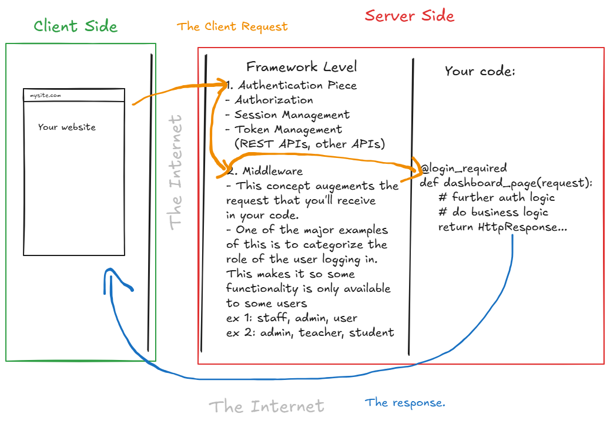
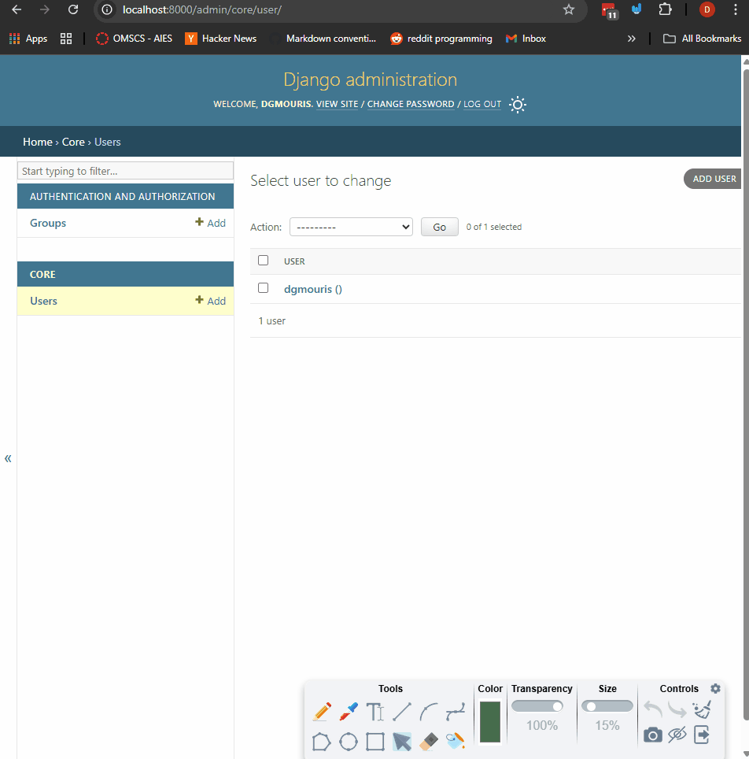
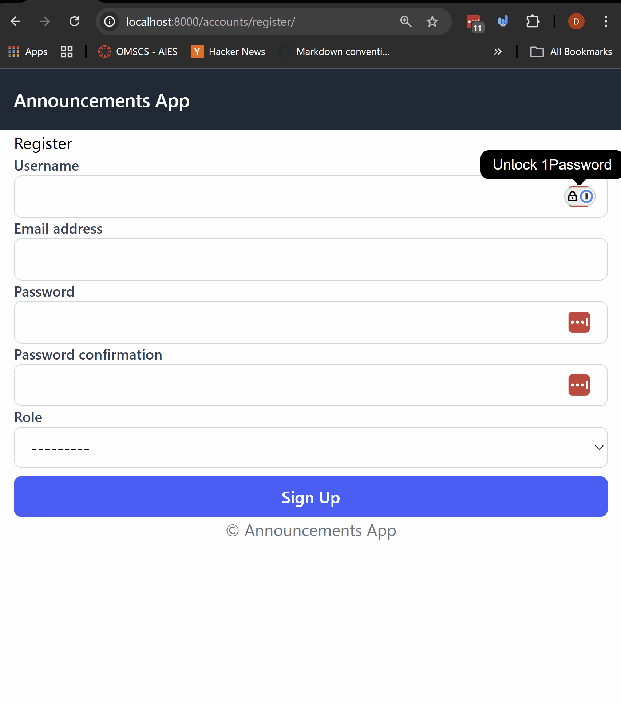
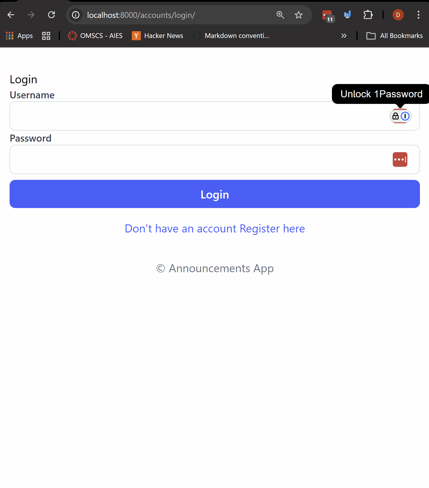
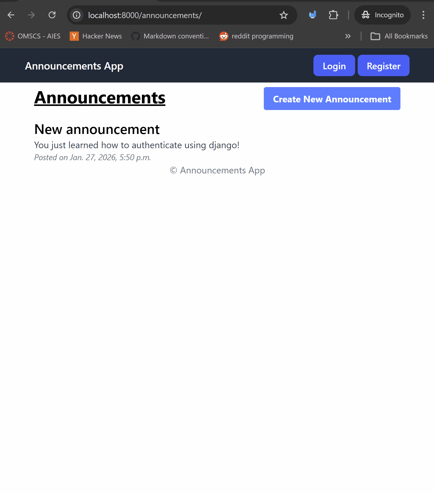

# Authentication Fundamentals

So far we've created sites that you don't have login to use.

In this module we're going to create sites that multiple users can use, and each user has their own account.

## Prerequisites
- Create a new virtual environment and install the packages from the `requirements.txt` file.


## Steps

### 1. Let's talk authentication and the roles of frameworks.

In the diagram below we can see a bit more how authentication works in a web application when you're using a framework.



1. When a user visits the site (on the client side <span style="color:green">shown in green</span>) or app they are either not logged in or logged in when the my a request <span style="color: orange">shown in orange</span>
2. When a user visits the site (on the client side <span style="color:green">shown in green</span>) or app, they are either not logged in or logged in when they make a request <span style="color: orange">shown in orange</span>
3. The request is sent over the internet to the <span style="color: red">server side shown in red</span> where the web server (nginx, apache, etc) (also discussed in the future) receives the request and sends it to the web application (Django, Flask, etc).
4. The framework (Django, Flask, etc) receives the request and checks to see if the user is logged in or not. It also performs what's called middleware to process the request.
Let's talk about a few scenarios:
    - If the user is not logged in and the view requires login, the framework will redirect the user to the login page or return a 401 unauthorized response.
    - If the user is logged in and the view requires login, the framework will allow the request to proceed to the view.
    - If the user is logged in and the view requires a specific permission, the framework will check to see if the user has that permission. If they do, the request will proceed to the view. If they don't, the framework will return a 403 forbidden response.
      - This is where middleware comes in. Middleware is a way to process requests and responses globally before they reach the view or after the view has processed them.
      - You can also perform this in the view itself, but it's better to do it in middleware so that you don't have to repeat the same code in every view.
5. The view which has the decorator `@login_required` or the mixin `LoginRequiredMixin` (class based view) will process the request and return a response, this is  <span style="color: blue">shown in blue</span>.

This is a very high level overview of how authentication works in a web application. There are many more details and nuances to it, but this should give you a good understanding of the fundamentals.

Let's walk through an example and see how it works in practice.

### 2. Let's talk about the app that we're building.

In this example (the `announcements_project`) we're going to create an app where there's two roles:
- Teacher
- Student
Let's talk about the views
- Create - only teachers can create an announcement
- List - both teachers and students can see the list of announcements
- Detail - both teachers and students can see the detail of an announcement
- Login/Logout - both teachers and students can login and logout
- Registration - both teachers and students can register

### 3. Let's create a `core` app, that will hold our custom user model.

The user model is the most important part of authentication. It's what holds all the information about the user, such as their username, password, email, etc.

In Django, you can use the built-in user model, but it's recommended to create a custom user model so that you can add additional fields and functionality.

For us, we're going to add a `role` field so that we can differentiate between teachers and students. This also gives us the flexibility to add more roles in the future if needed.

```bash
python manage.py startapp core
```

Let's add the `core` app to the `INSTALLED_APPS` in `announcements_project/settings.py`.

```python

INSTALLED_APPS = [
    # ... default apps ...
    'core',
]
```


### 4. Let's create a custom `user` model, update the settings, and apply migrations.


#### 4.1 In `core/models.py` create a custom user model that inherits from `AbstractUser` and add a `role` field.

```python
from django.db import models
from django.contrib.auth.models import AbstractUser

class User(AbstractUser):
    ROLE_CHOICES = (
        ('teacher', 'Teacher'),
        ('student', 'Student'),
    )
    role = models.CharField(max_length=10, choices=ROLE_CHOICES)

    # this is purely for convenience when we print out a user object
    def __str__(self):
        return f"{self.username} ({self.role})"
```

####  4.2 Now, let's update the `AUTH_USER_MODEL` setting in `announcements_project/settings.py` to point to our custom user model.
```python
# you can add this at the bottom of the file
# as it's not created yet.
AUTH_USER_MODEL = 'core.User'

```
####  4.3 add the custom user model to the admin so we can create users from the admin interface in the `core/admin.py` file.
```python
from django.contrib import admin

from .models import User

admin.site.register(User)
```


####  4.4 Since we created a custom user model, we need to create and apply migrations.
In your terminal run the commands below:
```bash
python manage.py makemigrations
python manage.py migrate
```

So far we have created a custom user model with a `role` field and updated the settings to use it.

### 5. Let's create a superuser and add a role to it.

Create the superuser with the command below:
```bash
python manage.py createsuperuser
```

Go to the admin interface, login, and take a look at the `User` model and let's add a role to the superuser.

- you see that users added in this way don't have a role yet so we need to add a role to the superuser.

### 6. Let's take a look at the `announcements` app.

In the `announcements` app we have the following:
- in `models.py` we have model called `Announcement` that has a `title`, `message`, `created_at`, `updated_at` and the `created_by` fields.
- in the `forms.py` we have a form called `AnnouncementForm` that is a `ModelForm` for the `Announcement` model.
- in the `views.py` we have the following views:
  - `announcement_list` - a view that lists all the announcements.
  - `create_announcement` - a view that allows (right now) _anyone_ to create an announcement. (We're going to fix this with our roles and our newly created user model).
- in the `admin.py` we have registered the `Announcement` model so we can create announcements from the admin interface.

We want to make sure that only teachers can create announcements, and both teachers and students can view the list of announcements.

So let's implement registration and login functionality first, and then we'll implement the role-based access control.

### 7. Let's implement registration functionality to create a user with a role.

1. Create the file `core/forms.py` and let's create a `UserRegistrationForm` that inherits from `UserCreationForm` and adds the `role` field.
    - Note the `UserCreationForm` is a built-in form that Django provides to handle user creation and password validation safely.
      - **Important**: Always use Django's built-in forms for user creation and authentication to ensure security best practices are followed.
```python
from django import forms
from django.contrib.auth.forms import UserCreationForm
from .models import User

class UserRegistrationForm(UserCreationForm):
    class Meta:
        model = User
        fields = [
            # inherited field from the creation forms
            'username',
            'email',
            'role',
            'password1',
            'password2',
            # our custom field!
            'role'
        ]

```

2. Let's create the registration view in `core/views.py`. In this view we handle both the get and post requests.
    - if the request is a post request, we validate the form and if it's valid we save the user and log them in, later we'll redirect them to the announcement list view.
    - if the request is a get request, we render the registration form.
```python
from django.shortcuts import render, redirect
from .forms import UserRegistrationForm
from django.contrib.auth import login, authenticate
# login function allows us to log in a user programmatically
# Note: This can be a bit confusing, but the login function does not authenticate the user, it just logs them in.
# authenticate function allows us to authenticate a user programmatically this tests the username and password against the database.

def register(request):
    if request.method == "POST":
        form = UserRegistrationForm(request.POST)
        if form.is_valid():
            user = form.save()
            login(request, user)  # auto login after register
            # redirect to announcement list
            # we'll implement this piece later
            # return redirect("announcement_list")
    else:
        form = UserRegistrationForm()
    return render(request, "core/register.html", {"form": form})

```
Just a note about the `

1. A template has been given you to in the `templates-to-use` folder called `register.html`. Copy it to a new folder called `core` in the `templates` folder of the project.
- take a look that we're just looping through the fields and rendering them with a bit of styling (learned in your other courses).

1. Let's create a `urls.py` file in the `core` app and add the registration view to it.
```python
from django.urls import path

from .views import register

urlpatterns = [
    path("register/", register, name="register"),
]
```
5. in the `announcements_project/urls.py` file, include the `core` app urls.
```python
from django.contrib import admin
from django.urls import path, include
from core.views import register

urlpatterns = [
    path('admin/', admin.site.urls),
    path('accounts/', include('core.urls')),  # registration view added!
]
```

### 8. Let's create a page that the user is redirected to after registration and login.

1. Let's add the announcement app to the settings file `announcements_project/settings.py`.
```python
INSTALLED_APPS = [
    # ...
    'core', # added earlier
    'announcements',
]
```
2. Let's take a look and add the `urls` of `announcements` to the project in the `announcements_project/urls.py` file.

If you take a look at the `announcements/urls.py` file you'll see that there are two views:
- `announcement_list` - lists all the announcements, this is important because we're going to be using this page as the landing page after registration and login.
- `create_announcement` - creates a new announcement.

Let's add the `announcements` urls to the project urls.
```python
from django.contrib import admin
from django.urls import path, include

urlpatterns = [
    path("admin/", admin.site.urls),
    path('accounts/', include('core.urls')),  # From before.
    path('announcements/', include('announcements.urls')),  # announcements app urls
]
```

3. Now, let's update the registration view to redirect to the announcement list view after successful registration.

Open the `core/views.py` file and update the `register` view.

```python
from django.shortcuts import render, redirect
from django.contrib.auth import login, authenticate

from .forms import UserRegistrationForm

def register(request):
    if request.method == "POST":
        form = UserRegistrationForm(request.POST)
        if form.is_valid():
            user = form.save()
            login(request, user)  # auto login after register
            # we implemented the announcement lists let's redirect there after registration
            return redirect("announcement_list")
            # note on the above that it's using the name of the url pattern from announcements/urls.py
            # just another note here, right before the redirect we could also
            # send a welcome email or perform other actions.
    else:
        form = UserRegistrationForm()
    return render(request, "core/register.html", {"form": form})
```
So in the above we have performed a full registration. Just a note as well you could also add flash messages to inform the user that they have registered successfully (more on this in future courses).

Now that we have the registration working (see below), let's implement login and logout functionality.


Note if you'd like to make sure that users are created you can go to the admin interface click "Users" and see the list of users created.

### 8. Let's implement the login functionality.

We need to be able to login and logout users, this is fundamental to most if not all web applications.

We're going to do this two ways:
- The first being using Django's built-in authentication views.
- The second being creating our own custom login view (this is optional but good to know, how to do)

#### 8.1 Using Django's built-in authentication views.

1. Copy the `login.html` template from the `templates-to-use` folder to the `core/templates/core/` folder.


2. In the `core/urls.py` file, let's add the login and logout views using Django's built-in authentication views.
```python
from django.urls import path
# these are the built-in auth views
from django.contrib.auth import views as auth_views

from .views import register

urlpatterns = [
    path("register/", register, name="register"),
    # this adds the login view as a form
    path("login/", auth_views.LoginView.as_view(
        template_name="core/login.html"), name="login",
        ),
    # this adds the logout view
    path("logout/", auth_views.LogoutView.as_view(), name="logout"),
]
```
This will allow us to use the built-in login and logout views without having to create our own views, but to do so we're going to need to add a couple of settings.

3. Let's update the settings file `announcements_project/settings.py` to add the login redirect url and logout redirect url.
- At the bottom of the settings file add the following lines.
```python
# ... other settings ...

# Login settings
LOGIN_REDIRECT_URL = '/announcements/'  # after login original LOGIN_REDIRECT_URL = '/'
LOGOUT_REDIRECT_URL = '/accounts/login/'  # after logout
LOGIN_URL = '/accounts/login/' #
```

This will ensure that after login the user is redirected to the announcement list view, and after logout the user is redirected to the login page.

This will be the method that is asked for on the assignment and lab.


#### 8.2 (Optional) Creating a custom login view.

Note: you don't need to implement this but it's a good learning exercise to see how to create your own login view.

1. In the `core/views.py` file, let's create a custom login view.
```python
from django.contrib.auth import authenticate, login
from django.shortcuts import render, redirect
# you can import the default login form here
from django.contrib.auth.forms import AuthenticationForm

def custom_login(request):
    if request.method == "POST":
        form = AuthenticationForm(request, data=request.POST)
        if form.is_valid():
            username = form.cleaned_data.get('username')
            password = form.cleaned_data.get('password')
            # checks the username and password against the database
            user = authenticate(request, username=username, password=password)
            # authenticate will return a user object if the username and password are correct
            # otherwise it will return None
            if user is not None:
                login(request, user)
                return redirect("announcement_list")
    else:
        form = AuthenticationForm()
    return render(request, "core/login.html", {"form": form})
```
You can see here that we're using the same fundamental ideas as before in forms. Let's talk a bit more about what we're doing here.
- We're getting the `username` and `password` from the `cleaned_data` of the `AuthenticationForm`. Note you can also customize this form in the same way we did for the registration form if you'd like.
- We're using the `authenticate` function to check the username and password, and then using the `login` function to log the user in.

This is pretty powerful because we can leverage django's built-in authentication process (which is secure and robust) while still having the flexibility to create our own views and handle the logic ourselves.

2. In the `core/urls.py` file, let's add the custom login view.
```python
from django.urls import path
from .views import register, custom_login
from django.contrib.auth import views as auth_views

urlpatterns = [
    path("register/", register, name="register"),
    # this adds the default login view as a form below
    # path("login/", auth_views.LoginView.as_view(template_name="core/login.html"), name="login"),
    # we've changed the login path to use our custom login view
    path("login/", custom_login, name="login"),  # custom login view
    # logout doesn't need to be custom, we can use the built-in one
    path("logout/", auth_views.LogoutView.as_view(), name="logout"),
]
```

Let's take a look at this in action:



### 9. Let's implement the logout functionality and add auth links to the templates.

Right now our application can login, logout, and register users, but users can't see or access these views because there are no links in the templates.

1. Let's add some html to the `templates/base.html` to handle this. Open the `templates/base.html` file and add the following code to the navigation bar section.
```html

    <nav class="bg-gray-800 p-4">
        <div class="max-w-2xl mx-auto flex justify-between items-center">
            <!-- Jinja URL used!-->
            <a href="" class="text-white text-lg font-semibold">
                Announcements App
            </a>
            <!--  Check if the user is authenticated -->
            <div>
                <!--  Add logout tag to action -->
                <form method="post" action="#">
                    <span class="text-gray-300 mr-4">
                        <!--  Add username and the role below -->
                        Hello, USERNAME, ROLE
                    </span>
                    <!--  Add CSRF Token -->

                    <button type="submit" class="px-4 py-2 bg-red-600 text-white font-semibold rounded-lg hover:bg-red-700 focus:outline-none focus:ring-2 focus:ring-red-500 focus:ring-offset-2">
                        Logout
                    </button>
                </form>
            </div>
            <!--  Else if the user is not authenticated -->
            <div>
                <!--  Add login template tag -->
                <a href="#" class="px-4 py-2 bg-blue-600 text-white font-semibold rounded-lg hover:bg-blue-700 focus:outline-none focus:ring-2 focus:ring-blue-500 focus:ring-offset-2">Login</a>
                <!--  Add register template tag -->
                <a href="#" class="px-4 py-2 bg-blue-600 text-white font-semibold rounded-lg hover:bg-blue-700 focus:outline-none focus:ring-2 focus:ring-blue-500 focus:ring-offset-2">Register</a>
            </div>
            <!--  Close the if statement. -->


        </div>
    </nav>

```
This is a bit of a mess, but we need to add the template tags to check if the user is authenticated or not.
- we can do this because there's a `user` object avaiable in the template context by default when using Django's authentication system.
2. Let's use it so that we can show different links based on whether the user is logged in or not.
```html
    <nav class="bg-gray-800 p-4">
        <div class="max-w-2xl mx-auto flex justify-between items-center">
            <!-- Jinja URL used!-->
            <a href="" class="text-white text-lg font-semibold">
                Announcements App
            </a>
            <!--  Check if the user is authenticated -->
            
            <div>
                <!--  Add logout tag to action -->
                <form method="post" action="#">
                    <span class="text-gray-300 mr-4">
                        <!--  Add username and the role below -->
                        Hello, USERNAME, ROLE
                    </span>
                    <!--  Add CSRF Token -->

                    <button type="submit" class="px-4 py-2 bg-red-600 text-white font-semibold rounded-lg hover:bg-red-700 focus:outline-none focus:ring-2 focus:ring-red-500 focus:ring-offset-2">
                        Logout
                    </button>
                </form>
            </div>
            <!--  Else if the user is not authenticated -->
            
            <div>
                <!--  Add login template tag -->
                <a href="#" class="px-4 py-2 bg-blue-600 text-white font-semibold rounded-lg hover:bg-blue-700 focus:outline-none focus:ring-2 focus:ring-blue-500 focus:ring-offset-2">Login</a>
                <!--  Add register template tag -->
                <a href="#" class="px-4 py-2 bg-blue-600 text-white font-semibold rounded-lg hover:bg-blue-700 focus:outline-none focus:ring-2 focus:ring-blue-500 focus:ring-offset-2">Register</a>
            </div>
            <!--  Close the if statement. -->
            

        </div>
    </nav>

```
- In the above code, we check if the user is authenticated using the `user.is_authenticated` template tag.
  - If the user is authenticated, we show a logout form with the username and role.
  - If the user is not authenticated, we show login and register links.

3. Let's Fix the logout form and the login/register links, and also display the users name.

```html
    <nav class="bg-gray-800 p-4">
        <div class="max-w-2xl mx-auto flex justify-between items-center">
            <!-- Jinja URL used!-->
            <a href="" class="text-white text-lg font-semibold">
                Announcements App
            </a>
            <!--  Check if the user is authenticated -->
            
            <div>
                <!--  Add logout tag to action -->
                <form method="post" action="">
                    <span class="text-gray-300 mr-4">
                        <!--  Add username and the role below -->
                        Hello, {{user.username}}, {{user.role}}
                    </span>
                    <!--  Add CSRF Token -->
                    
                    <button type="submit" class="px-4 py-2 bg-red-600 text-white font-semibold rounded-lg hover:bg-red-700 focus:outline-none focus:ring-2 focus:ring-red-500 focus:ring-offset-2">
                        Logout
                    </button>
                </form>
            </div>
            <!--  Else if the user is not authenticated -->
            
            <div>
                <!--  Add login template tag -->
                <a href="" class="px-4 py-2 bg-blue-600 text-white font-semibold rounded-lg hover:bg-blue-700 focus:outline-none focus:ring-2 focus:ring-blue-500 focus:ring-offset-2">Login</a>
                <!--  Add register template tag -->
                <a href="" class="px-4 py-2 bg-blue-600 text-white font-semibold rounded-lg hover:bg-blue-700 focus:outline-none focus:ring-2 focus:ring-blue-500 focus:ring-offset-2">Register</a>
            </div>
            <!--  Close the if statement. -->
            

        </div>
    </nav>

```
Let's talk about the changes we made:
- In the logout form, we added the `action` attribute to point to the logout url using the `` template tag.
- We added the `` template tag to include a CSRF token in the form for security.
- In the login and register links, we added the `href` attribute to point to the
login url using the `` template tag and the register url using the `` template tag.

Let's take a look at the new functionality in action:


### 10. Let's now restrict access to the announcements page using the `@login_required` decorator.

One thing that we want to do in our application is ensure that only logged-in users can see a view or page here.

We're going to use the `@login_required` decorator to restrict access to the announcement list view and the create announcement view.

1. In the `announcements/views.py` file, let's import the `login_required` decorator and apply it to the views.
```python
from django.contrib.auth.decorators import login_required
from django.shortcuts import render, redirect
from .models import Announcement

# note that the view doesn't change we just add the decorator.
@login_required
def announcement_list(request):
    announcements = Announcement.objects.all().order_by('-created_at')
    return render(request, "announcements/announcement_list.html", {"announcements": announcements})
```

## Challenge/Exercise

Take one of the previous projects that we've built in class and implement the authentication process using the above steps.
This will include:
- Creating a `core` app (this is common practice to have a core app for authentication and other core functionality).
- Creating a custom user model with extra fields if needed.
- Implementing the registration view and template.
- Implementing the login with a template.
- Implementing the links in the base template to login, logout and register.
- Restricting access to certain views using the `@login_required` decorator.


## Conclusion

In this example we've implemented a full authentication system using Django's built-in authentication views and a custom user model with roles.

In the next example we're going to implement role based access control to restrict access to certain views based on the user's role.
