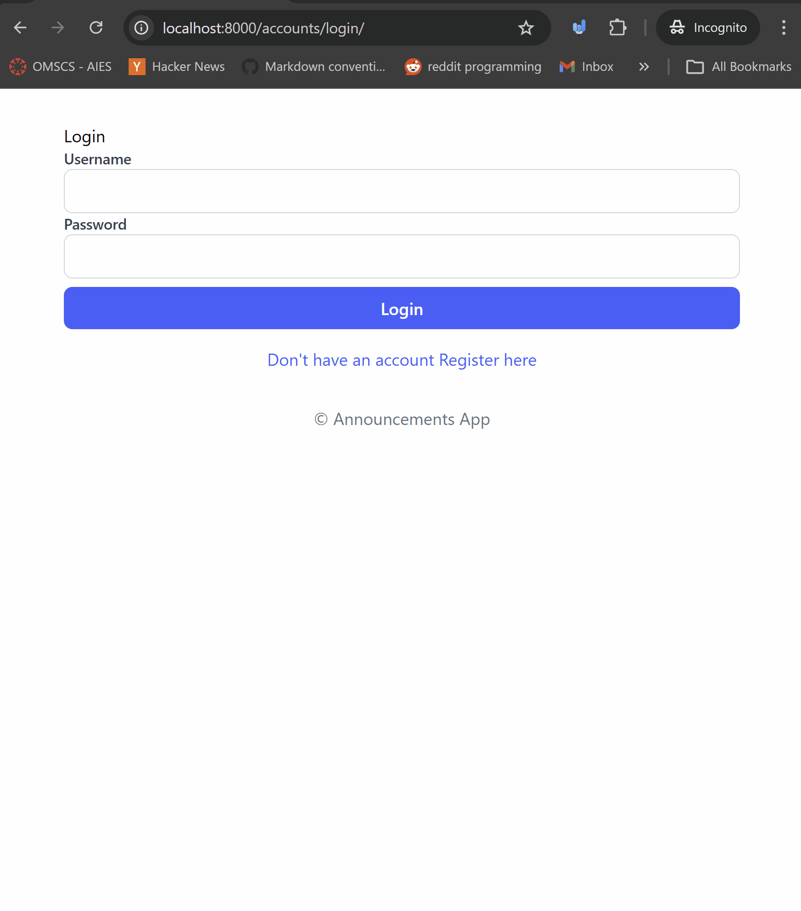
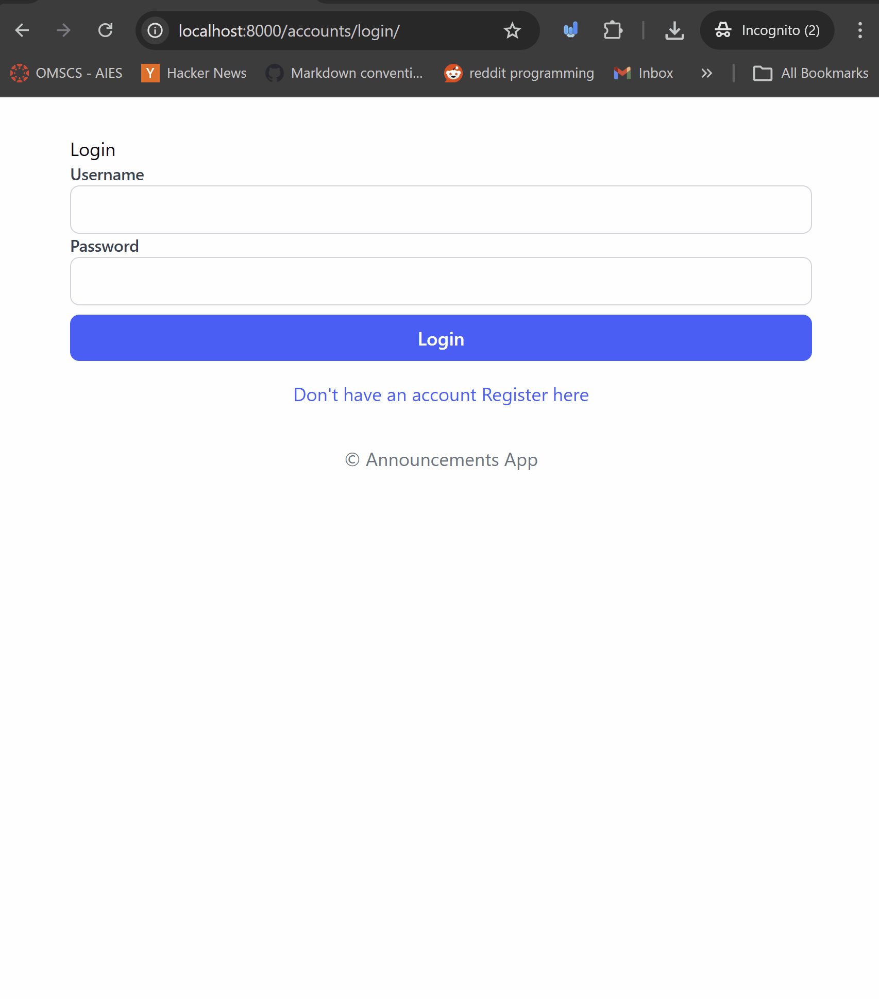
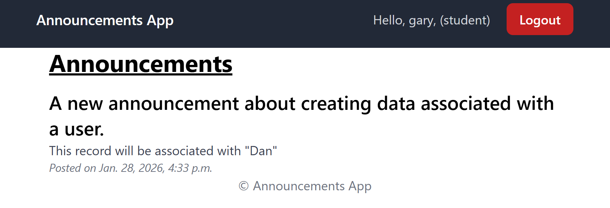
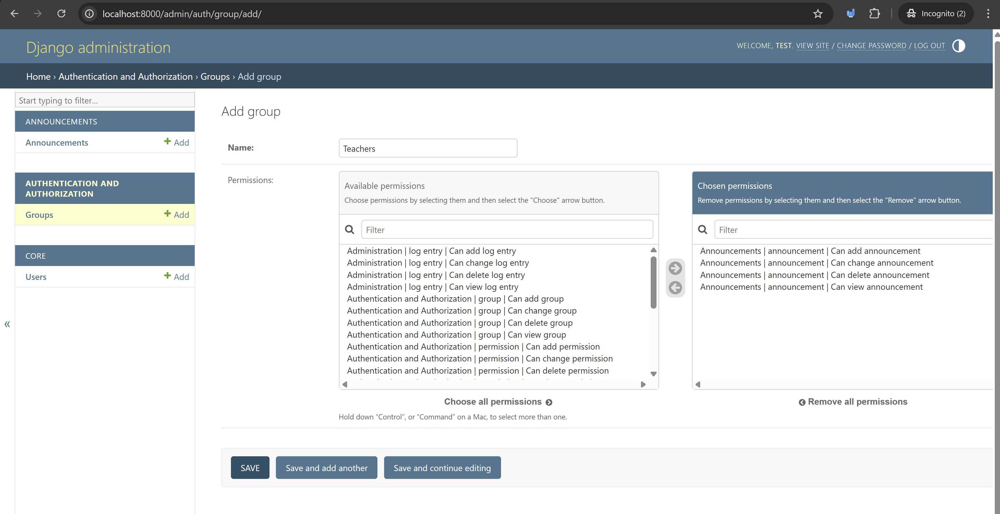
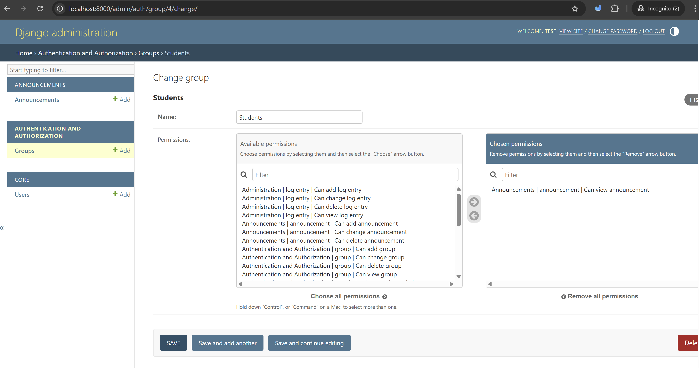
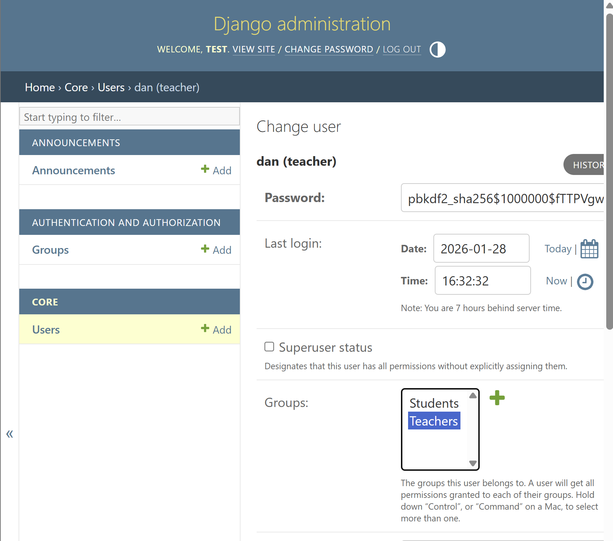
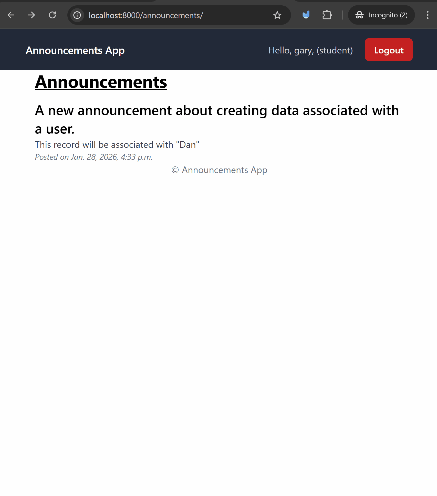

# Authentication with Authorization Fundamentals and User Specific Data

Last couple of lessons we took a look at a full authentication system with registration, login, logout, and password reset.

In this lesson we will take a look at how authentication works under the hood and how frameworks like Django help us manage authentication and authorization. We will also take a look at how to make data user specific by creating an account page that shows user specific data.

## Prerequisites
- Create a new virtual environment and install the packages from the `requirements.txt` file.

## Steps

We're going to restrict authorization to create announcements to only users with the "Teacher" role, we're also going to associate the announcement with the user that created it.

### 1. Let's talk about the views and the difference between authentication and authorization

**Authentication** is the process of verifying the identity of a user. It answers the question "Who are you?". In web applications, this is typically done through login systems where users provide credentials (like username and password) to prove their identity.

**Authorization**, on the other hand, is the process of determining what an authenticated user is allowed to do. It answers the question "What are you allowed to do?". This involves checking the user's permissions and roles to see if they have access to certain resources or actions within the application.

#### 1.1 Let's break this down with a learning management system (LMS) example:
- Authentication is when a student, teacher or admin logs into the LMS using their username and password. The system verifies their identity and grants them access to the platform.
- Authorization is determining the users role in the application.
    - A student can view course materials, submit assignments, and participate in discussions.
    - A teacher can create and manage courses, grade assignments, and communicate with students.
    - An admin can manage users, configure system settings, and oversee the overall operation of the LMS.

This is called **Role Based Access Control (RBAC)** where users are assigned roles that define their permissions within the system.

#### 1.2 Different ways to implement authorization in Django:
- **Model Level Authorization** this means that you are controlling access to data at the model level (so the database level, basically). This is done using Django's built-in permissions system.
    - Using Django's built-in permissions system to assign permissions to users and groups.
    - This allows for granular control over what actions users can perform on specific models (e.g., add, view, change, delete).
    - Note: we're not going to be using this in this course assignments but it's ood to know about it.
- **View Level Authorization** this means that you are controlling access to views (so the web pages or API endpoints). This is done using decorators (for functions) and mixins (for class based ) in Django.
    - We're going to be using the decorator `user_passes_test` for function-based views to restrict access based on custom logic, and the `UserPassesTestMixin` for class-based views.
    - If you're using the model level permissions system, you can use decorators like `permission_required` for function-based views and mixins like `PermissionRequiredMixin` for class-based views (more on this in later lessons). Again we won't be using this in this course assignments but it's good to know about it.

#### 1.3 Let's talk about the views in our application and who has the permission to do what.

- Viewing Announcements Page (announcements/)
    - Only logged in users can see the announcements page.
    - We did this at the end of the last example with the `@login_required` decorator.
- Creating Announcements (announcements/create/)
    - Only Teachers can create announcements.
    - We're going to build this out so that this is only visible to users with the "Teacher" role, and each announcement created is associated with the teacher who created it.
- Logging In and Registering ( accounts/login/ and accounts/register/)
    - Everyone can access the login and registration pages.

### 2. Let's restrict the create view to only teachers.

Right now the create announcement view is accessible by any logged in user, and there's nothing in the template. Let's change that so that only users with the "Teacher" role can access the create announcement view.

#### 2.1 Let's start by updating the template and show the title of the page
Change the `announcements/templates/announcements/create_announcement.html` file to the following:

```html



<div class="max-w-2xl mx-auto px-4 md:px-0">
    <div class="flex justify-between items-center mb-4">

        <h1 class="text-3xl font-bold underline">
            Create an Announcement
        </h1>
    </div>
</div>

```
#### 2.2 Let's create a permission check function with `user_passes_test`

In the `announcements/views.py` file, let's import the `user_passes_test` decorator and create a function that checks if the user has the "Teacher" role.
- Remember that in our `core/models.py` we created a `User` model that we have defined as the `AUTH_USER_MODEL` in our settings. This model has a `role` field that can be either "Student" or "Teacher".
- The `user_passes_test` decorator will pass the `user` object to the function that we define, which we're going to call it `is_teacher`, it also has a handy param

```python
from django.shortcuts import render, redirect
# import the user_passes_test decorator
from django.contrib.auth.decorators import login_required, user_passes_test

from .models import Announcement

def is_teacher(user):
    # the user object is passed in here by the decorator
    return user.role == 'Teacher'

# ... list view here...

# this will restrict access to only users that pass the is_teacher test
# it will redirect to the login page if the user does not have permission.
@login_required
@user_passes_test(is_teacher, login_url='login')
def create_announcement(request):
    return render(request, 'announcements/create_announcement.html')

```
So now if you try to access the create announcement page as a student you will be redirected to the login page.
- This isn't the best user experience, but at the same time the user is trying to access something they don't have permission to access, so redirecting to login is a reasonable action.
  - In a real application you might want to create a custom "403 Forbidden" page that tells the user they don't have permission to access that page.
    - We'll do this next.

This is probably one of the simplest ways to do authorization in django, and this will work great for smaller applications.

Let's take a look at this in action with two users: one that is a student and one that is a teacher.


This is great! we now have a way to restrict access to views based on user roles. We'll improve this further later on by creating a custom "403 Forbidden" page.

We're going to create a form that will take in a user and save the announcement for that user (which will now be a teacher) in the next step.

### 3. Create a form and view that will take in a user and save the announcement for that user only.

In our previous module when we looked at updating an item in a form, we would set it explicitly in the view.

We're going to do something similar here except we're going to us the request user to set the `created_by` field on the `Announcement` model.

#### 3.1 Create the form for the `Announcement` model

In the `announcements/forms.py` file, let's create a form for the `Announcement` model that only includes the `title` and `content` fields.

```python
from django import forms

from .models import Announcement

class AnnouncementForm(forms.ModelForm):
    class Meta:
        model = Announcement
        fields = ['title', 'message']
```
You can see here that we're only adding two of the fields from the form. Let's talk about all of the fields on the `Announcement` model:
- `title`: Will be added by the form.
- `message`: Will be added by the form.
- `created_by` will be set in the view using the `request.user`.
- `created_at` will be set automatically when the announcement is created.
- `updated_at` will be set automatically when the announcement is updated.

#### 3.2 Change the create view to use the form and set the `created_by` field.

In the `announcements/views.py` file, let's update the `create_announcement` view to use the `AnnouncementForm` and set the `created_by` field.

```python
# ... imports ...
from .forms import AnnouncementForm
# ... is_teacher function ...
# ... list view ...

@login_required
@user_passes_test(is_teacher, login_url='login')
def create_announcement(request):
    if request.method == 'POST':
        form = AnnouncementForm(request.POST)
        if form.is_valid():
            announcement = form.save(commit=False)
            # the commit false will prevent the form from saving to the database
            # set the created_by field to the current user
            announcement.created_by = request.user
            announcement.save()
            # save the announcement to the database.
            return redirect('announcement_list')
    else:
        form = AnnouncementForm()
    return render(request, 'announcements/create_announcement.html', {'form': form})
```

Let's talk about what's happening here:
- First our user needs to be logged in and pass the `is_teacher` test to access this view, so we're going to have access to the `request.user` object (which won't be None).
- We're checking if the request is a POST like the forms we've built before, we also create an instance of the `AnnouncementForm` with the `request.POST` data.
- If the form is valid, we create an `announcement` object from the form but we don't save it to the database yet (using `commit=False`).
- We then set the `created_by` field to the current user (`request.user`), this is pretty similar _updating_ an object in a form like the last module.
- Finally we save the announcement to the database and redirect to the announcements list page.

### 3.3 Update the template to show the form.

In the `announcements/templates/announcements/create_announcement.html` file, let's update the template to show the form.

This is the same pattern we've used before to render forms in templates.
```html




<div class="max-w-2xl mx-auto px-4 md:px-0">
  <div class="flex justify-between items-center mb-4">

    <h1 class="text-3xl font-bold underline">
      Create an Announcement
    </h1>
  </div>
  <form method="post">
    
    
      <div>
        <label for="{{ field.id_for_label }}" class="block text-sm font-medium text-gray-700">
          {{ field.label }}
        </label>
        {{ field }}
        
          <p class="text-sm text-red-500 mt-1">{{ field.errors|striptags }}</p>
        
      </div>
    
    
    <div class="mt-4 mb-4 p-4 bg-red-100 text-red-800 border border-red-200 rounded">
        <ul>
            
            <li>{{ error }}</li>
            
        </ul>
    </div>
    
    <button type="submit" class="mt-2 w-full bg-blue-600 hover:bg-blue-700 text-white font-semibold py-2 px-4 rounded-lg">
      Create Announcement
    </button>
  </form>
</div>

```

Let's take a look at this in action by logging in as a teacher and creating an announcement. We're also going to take a look at the data base to see that the announcement is associated with the correct user.


### 4. Let's improve the user experience so that the Students don't see the "Create Announcement" link.

In the `announcements/templates/announcements/announcement_list.html` file, let's update the template to only show the "Create Announcement" link if the user is a teacher.

Let's add an if statement around the link to check if the user is a teacher.

Change this link in the file
```html
<!-- title above. -->
<a class="bg-blue-500 hover:bg-blue-700 text-white font-bold mt-2 py-2 px-4 rounded" href="">Create New Announcement</a>
<!-- form below -->
```
So that it has an if statement that checks for a teacher role:
```html
<!-- title above. -->

<a class="bg-blue-500 hover:bg-blue-700 text-white font-bold mt-2 py-2 px-4 rounded" href="">Create New Announcement</a>

```
So now only users that are logged in and have the "Teacher" role will see the "Create Announcement" link, here's what it looks like



### 5. (Optional) Model Based permissions with `has_perm` and permissions with `Groups` and `Permissions` in the admin interface.
There's many ways to do authorization in django, and the method we've used here is one of the simplest ways to do it. Another option is to build your own permission system using django's built in permissions and groups (Note: this is the preferred way to do authorization in larger applications).

Let's talk about the concepts of `Permissions` and `Groups` in django.
**Permissions** are a way to define what actions a user can perform on a model. Every model has the following default permission actions:
    - add
    - change
    - delete
    - view
The permissions are defined in the format `APP_LABEL.ACTION_MODELNAME`, for example `announcements.add_announcement` for the `Announcement` model in the `announcements` app.

To check for a permission in your code you can use the `has_perm` method on the user object. For example:
```python
if request.user.has_perm('announcements.add_announcement'):
    # user has permission to add an announcement
    ...
```
or you can use the `permission_required` decorator for function based views:
```python
from django.contrib.auth.decorators import permission_required
# ... other imports, functions and views ...

@permission_required('announcements.add_announcement', login_url='login')
def create_announcement(request):
    ....
```
We'll also take a look at the `PermissionRequiredMixin` for class based views in later modules.

**Groups** are a way to group users together and assign permissions to the group. This way you can manage permissions for multiple users at once by assigning them to a group.
- In the admin interface you can add the permissions (in the format above) to the group.

#### 5.1 Let's create two `Groups` in the admin interface: "Teachers" and "Students".
In the admin interface, go to the "Groups" section and create a new group called "Teachers", add the following permissions to the group:
    - announcements.add_announcement
    - announcements.change_announcement
    - announcements.delete_announcement
    - announcements.view_announcement

It should look like this in the admin and then you should save the group.


You should then create a group called "Students" and add the following permission to the group:
    - announcements.view_announcement
It should look like this in the admin and then you should save the group.


#### 5.2 Let's assign users to the groups.

In the admin interface, go to the "Users" section and edit a user that you want to be a teacher. In the "Groups" section, add the user to the "Teachers" group and save the user.


Do the same for a student user and add them to the "Students" group.


Note: you can also do this programmatically when creating users by adding them to the group like this:
```python
from django.contrib.auth.models import Group
from core.models import User

# get the teacher
teacher_user = User.objects.filter(username='dan').first()
teacher_group = Group.objects.get(name='Teachers')
teacher_user.groups.add(teacher_group)
```
**Important** This would be fantastic to do in the `register` view when creating a new user, but we're not going to do that here to keep things simple.

#### 5.3 Let's update the create announcement view to use the `@permission_required` decorator to check for this permission.

In the `announcements/views.py` file, let's update the `create_announcement` view to use the `@permission_required` decorator instead of the `@user_passes_test` decorator.
```python
from django.contrib.auth.decorators import login_required, permission_required

@login_required
@permission_required('announcements.add_announcement', login_url='login')
def create_announcement(request):
    # ... rest of the view ...
```

Note: in the permission required decorator you can also pass a list of permissions if you want to check for multiple permissions like this:
```python

@permission_required(['announcements.add_announcement', 'announcements.change_announcement'], login_url='login')
def create_announcement(request):
    # ... rest of the view ...
```


### 6. (Optional) Custom Error pages and using them `raise_exception` with `permission_required`.

#### 6.1 Instead of redirecting to the view when a user doesn't have permission, we can raise an exception and show a custom error page.
In the `announcements/views.py` file, let's update the `create_announcement` view
```python
from django.contrib.auth.decorators import login_required, permission_required

@login_required
@permission_required('announcements.add_announcement', raise_exception=True)  # change login_url to raise_exception
def create_announcement(request):
    # ... rest of the view ...
```
This will raise a `PermissionDenied` exception when the user doesn't have permission to access the view, and will show a 403 error page.

#### 6.2 Create a custom "403 Forbidden" page and discussing other error pages.

Django has some built in views for handling errors like 404 and 500 errors that we can customize. We're going to the same for a 403 error page.

We can create our own templates for these views by creating a template with the name of the error code. The available error code are (you can take a look [here at the docs](https://docs.djangoproject.com/en/5.2/ref/views/)):
- `400.html` - for bad requests
- `403.html` - for forbidden access (what we'll implement here)
- `404.html` - for not found errors
- `500.html` - for server errors

Let's create a `403.html` file in the `templates` directory with the following content:

```html



<div class="max-w-2xl mx-auto px-4 md:px-0">
    <div class="flex justify-between items-center mb-4">

        <h1 class="text-3xl font-bold underline">
            You don't have permission to access this page.
        </h1>
    </div>
</div>

```

Now let's change the `permission_required` decorator in the `create_announcement` view to use this custom 403 page instead of redirecting to the login page.

```python
# ... imports ...
# ... is_teacher function ...
# ... list view ...
@login_required
@permission_required('announcements.add_announcement', raise_exception=True)
def create_announcement(request):
    # ... rest of the view ...
```

#### 6.3 Using permissions in the template to show/hide content.
In the `announcements/templates/announcements/announcement_list.html` file, let's update the template to only show the "Create Announcement" link if the user has the `announcements.add_announcement` permission.
- You can access the `perms` attribute on the user object in the template to check for permissions.
Change the code from this:
```html

<a class="bg-blue-500 hover:bg-blue-700 text-white font-bold mt-2 py-2 px-4 rounded" href="">
    Create New Announcement
</a>

```
to this:
```html

<a class="bg-blue-500 hover:bg-blue-700 text-white font-bold mt-2 py-2 px-4 rounded" href="">
    Create New Announcement
</a>

```

After all of this our application should look like the following if the user doesn't have permission to create an announcement:


## Challenge/Exercise
Let's create a model called `Event` that has the following fields:
- `name` (CharField)
- `date` (DateField)
- `created_by` (ForeignKey to User)

Add permissions to the model so that only the "Teacher" Group (or role) can create, update, and delete events, while "Students" can only view events.

Create the following views:
- List Events (accessible by all logged-in users)
- Create Event (accessible only by Teachers)

## Conclusion

Here we have really gone deep into the authentication and authorization system in Django. We've covered:
- The difference between authentication and authorization.
- How to restrict access to views based on user roles using decorators.
- How to create user-specific data by associating data with the logged-in user.
- How to use Django's built-in permissions and groups for more granular control over user actions.

A few closing notes:
- Other frameworks will have a similar concept of authentication and authorization, but the implementation details will vary.
- If you want to learn more about Django's authentication and authorization system, check out the [official documentation](https://docs.djangoproject.com/en/5.2/topics/auth/).
- If you want to check out a cool project to see a more complex implementation of authorization, check out [Django Guardian](https://django-guardian.readthedocs.io/en/stable/) which provides per-object permissions for Django.
- If you want to learn more about building authentication systems with Google, OAuth2, Github, etc. check out [Django Allauth](https://django-allauth.readthedocs.io/en/latest/) which is a popular package for handling social authentication in Django.


