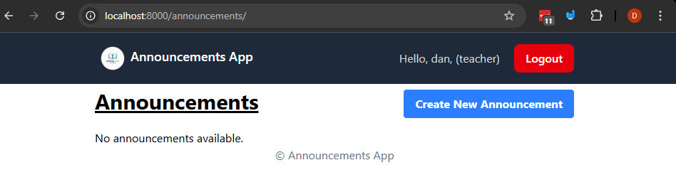
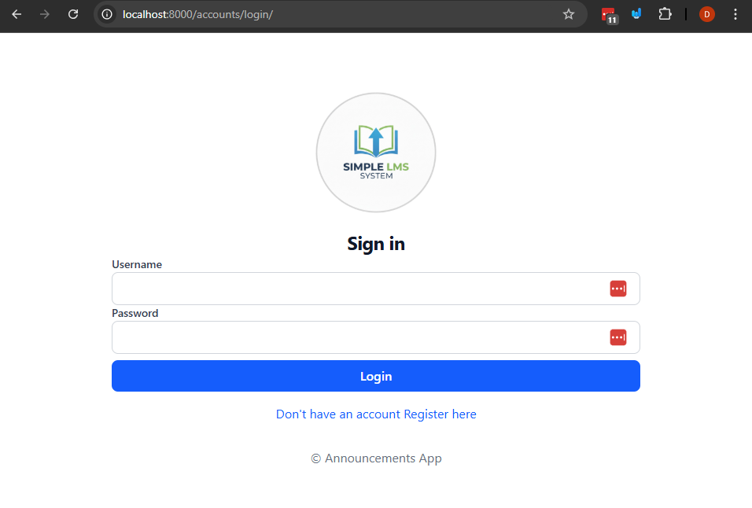
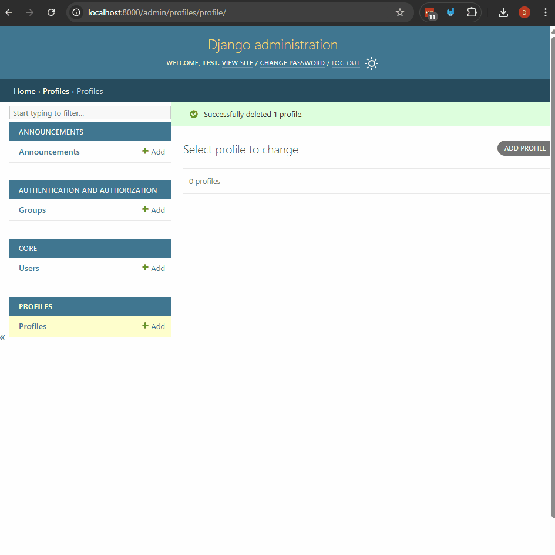
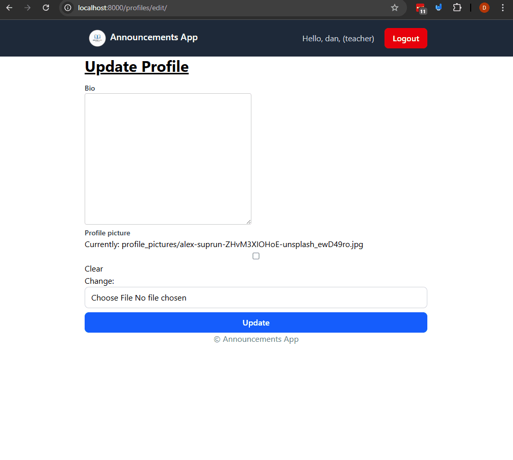
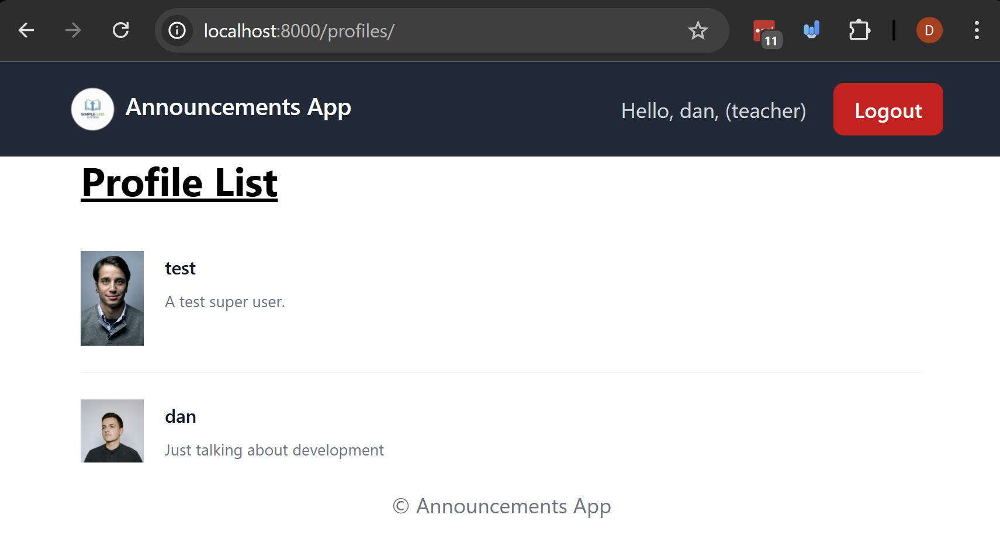

# Files and Media - Uploading Images

Uploading images and other types of media files is common in web apps. In this lesson we're going to learn how to handle file uploads in Django.

## Prerequisites
- Create a new virtual environment and install the packages from the `requirements.txt` file.

## Steps
We're going to learn about uploading images and media files in Django by having our users upload profile pictures to a `Profile` model associated with the built-in `User` model.


### 1. Let's talk about static files vs media files in a backend web application.

There's two main types of files that a web application might deal with: static files and media files.

**Static Files** are files that are part of your application, such as CSS files, JavaScript files, and images that are used in the website design. These files are typically stored in a `static` directory and are served to users when they visit the website.

To do this we'll need to do a few steps:
1. You'll need to set up your `settings.py` file to handle static files.
2. you'll need to use the `collectstatic` command to gather all the static files into one place for production use.

**Media Files** are files that are uploaded by users, such as profile pictures, documents, and other types of files. These files are typically stored in a `media` directory and are served to users when they request them.

To handle media files you'll need to do a few steps:
1. You'll need to set up your `settings.py` file to handle media files.
2. You'll need to set up your `urls.py` file to serve media files during development.
3. You'll need to create a model with an `ImageField` or `FileField` to handle the uploaded files.

We're going to update our web application so that we can use both static files and media files.


### 2. Let's set up our project to handle Static files so that we can serve JavaScript, CSS and images that are part of our application.

#### 2.1 Create a `static` directory in your project root (the same level as `manage.py`) add add the images there.

Once you create the the director add the images in the `images-use-folder` directory to the `static` directory you just created.

#### 2.2 Update your `settings.py` file to handle static files.
- In `settings.py`, set the `STATIC_URL` and `STATIC_ROOT` variables.
    - `STATIC_URL = '/static/'` will be the URL prefix for static files when you're trying to access them in your templates or your browser.
    - `STATICFILES_DIRS = [BASE_DIR / 'static']` will be the directory where all static files will be collected when you run the `collectstatic` command.
    Note: this is an array you can have multiple directories if needed.

Your `settings.py` file should look something like this:
```python
# ... other settings ...

# Static files configuation
STATIC_URL = '/static/'
STATICFILES_DIRS = [
    BASE_DIR / 'static'
]
# note: BASE_DIR is usually defined at the top of settings.py as the root directory of your project.
```

Note: this is going to be a bit different in production deployments but we're going to cover that a bit later on overall.

### 3. Let's use static files in our templates, in the `templates/base.html` template, and the `core/templates/core/login.html` template.

In your templates, you can use the `` template tag to load static files and use the `` template tag to reference static files.

#### 3.1 Let's add a logo image to the header in `templates/base.html`.

Open the `templates/base.html` file and make the following changes:

Change the template project name, in the navbar header section like from.
```html
<!-- ... html and head code ...  -->

<!-- ... more code ... -->
<a href="" class="text-white text-lg font-semibold">

    Announcements App
</a>
<!-- ... more code below.... -->


```
To the following:
```html


<!-- ... html and head code ...  -->

<!-- ... more code ... -->
<!-- Added "flex" class so that they're side by side. -->
<a href="" class="flex text-white text-lg font-semibold">
    <!-- Added image -->
    
    Announcements App
</a>
<!-- ... more code below.... -->

```
Let's talk about what we did here:
- We loaded the static template tag library with `` at the top of the template, this will allow us to use the `` template tag to reference static files.
- We added the class `flex` to the `<a>` tag so that the image and the text are side by side.
- We used the `` template tag to reference the image file in the static directory.

Once you have this completed you should see something like this.



#### 3.2 Let's add a background image to the login page in `core/templates/core/login.html`.

Open the `core/templates/core/login.html` file and make the following changes.

Change the data from
```html


<!-- ... header block ... -->


<div class="max-w-2xl mx-auto py-8 px-4 md:px-0">
  <h2>Login</h2>
  <form method="post">
    <!-- ... rest of the form ... -->
  </form>
</div>

```
To this so that includes the "load static" tag and an logo image.
```html



<!-- ... header block ... -->


<div class="max-w-2xl mx-auto py-8 px-4 md:px-0">
  <!-- Added formatting for  -->
  <div class="sm:mx-auto sm:w-full sm:max-w-sm">
      <!--  -->
      
      <h2 class="mt-4 text-center text-2xl/9 font-bold tracking-tight text-gray-900 dark:text-white">
          Login in
      </h2>
  </div>
  <!-- form unchanged -->
  <form method="post">
    <!-- ... rest of the form ... -->
  </form>
</div>

```
Let's talk about what we did here.
- we loaded the static template tag library with `` at the top of the template, this will allow us to use the `` template tag to reference static files.
- We added an image tag that uses the `` template tag to reference the image file in the static directory.

The end result should look something like this:



#### 3.4 Let's create a css file and use it in our base template.

Create a new directory called `css` in the `static` directory.

After doing that Create a new file called `styles.css` in the `static/css` directory.

In the `base.html` template we have the following in the `<head>` section:
```html
<!-- ... other code here ... -->
 
    <!-- just adding a border -->
    <style>
        input, select {
            width: 100%;
            border: 1px solid #d1d5db; /* Tailwind's gray-300 */
            border-radius: 0.5rem;      /* rounded-lg */
            padding: 0.5rem 0.75rem;    /* py-2 px-3 */
            outline: none;
        }
        input:focus, select:focus {
            border-color: #2563eb;      /* Tailwind's blue-600 */
            box-shadow: 0 0 0 2px #93c5fd; /* light blue ring */
        }
        textarea {
            border: 1px solid #ccc;
            border-radius: 4px;
            padding: 8px;
        }
    </style>
    
<!-- ... other code here ... -->
```

Let's remove that and instead link to the `static/css/styles.css` file we just created. The css file should look like this:
```css
input, select {
    width: 100%;
    border: 1px solid #d1d5db; /* Tailwind's gray-300 */
    border-radius: 0.5rem;      /* rounded-lg */
    padding: 0.5rem 0.75rem;    /* py-2 px-3 */
    outline: none;
}
input:focus, select:focus {
    border-color: #2563eb;      /* Tailwind's blue-600 */
    box-shadow: 0 0 0 2px #93c5fd; /* light blue ring */
}
textarea {
    border: 1px solid #ccc;
    border-radius: 4px;
    padding: 8px;
}
```
Now in the base template let's update the `<head>` section to link to the css file instead of having the styles inline.
Update the `<head>` section in `templates/base.html` to look like this:
```html
  <!-- Note this line is already included -->

<head>
    <meta charset="UTF-8" />
    <meta name="viewport" content="width=device-width, initial-scale=1.0" />
    <script src="https://cdn.jsdelivr.net/npm/@tailwindcss/browser@4"></script>
    <!-- New css file added -->
    <link rel="stylesheet" href="" />
    
    
    <title>
        Announcements App
    </title>

```

Now you won't see any changes but if you go to `http://localhost:8000/static/css/styles.css` you should see the css file being served.

This is essentially every thing you need to know about static files for now. We'll cover deployment in the future.

### 4. Let's set up our project to handle Media files so that users can upload profile pictures.

"Media Files" are files that are uploaded by users, such as profile pictures, documents, and other types of files. These files are typically stored in a `media` directory and are served to users when they request them.

This might differ in production deployments (again this is something we'll cover later on) but for development purposes we can set it up like this.


#### 4.1 Update your `settings.py` file to handle media files and install Pillow.
First, make sure you have the Pillow library installed, as it's required for handling image files in Django. You can install it using pip:
```
pip install Pillow
```

In `settings.py`, set the `MEDIA_URL` and `MEDIA_ROOT` variables.
```python

# Media files
MEDIA_URL = '/media/'
MEDIA_ROOT = BASE_DIR / 'media'
```

Create the `media` directory in the project root (the same level as `manage.py`), this will be where our uploaded files will be stored.
- For this example please create a `profile_pictures` directory inside the `media` directory to store profile pictures.


#### 4.2 Update the `urls.py` file to serve media files during development.
In the `announcements_project/urls.py` file, add the following code at the bottom of the file to serve media files during development:
```python
# ... other imports ...
from django.conf import settings
from django.conf.urls.static import static
# ... existing urlpatterns ...

# ... static files serving code ...

# Serving media files during development
if settings.DEBUG:
    urlpatterns += static(settings.MEDIA_URL, document_root=settings.MEDIA_ROOT)
```

Now that we have media files set up let's create a model to handle profile pictures for users.

### 5. Let's set up a new app called `profiles` to handle user profiles with profile pictures

#### 5.1 Create a new app called `profiles` and add it to the `INSTALLED_APPS` list in `settings.py`.
```
python manage.py startapp profiles
```
This is just going to handle the profile pictures and a short bio for users.

Open the `settings.py` file and add the `profiles` app to the `INSTALLED_APPS` list:
```python
INSTALLED_APPS = [
    # ... other installed apps ...
    'profiles',
]
```

#### 5.2 Create a `Profile` model in `profiles/models.py` with a `OneToOneField` to the built-in User model, an ImageField for the profile picture, and a TextField for a short bio.

We can add fields to a database model to handle uploaded images using Django's `ImageField`. This field is specifically designed to handle image uploads and works well with Django's file storage system.

Note: Later on we'll use the `FileField` to handle non-image file uploads.

In `profiles/models.py`, add the following code:
```python
from django.db import models
from django.conf import settings

# Create your models here.
class Profile(models.Model):
    user = models.OneToOneField(
        settings.AUTH_USER_MODEL , on_delete=models.CASCADE, related_name="profile"
    )
    bio = models.TextField(blank=True)
    profile_picture = models.ImageField(
        upload_to="profile_pictures/", blank=True, null=True
    )

    def __str__(self):
        return f"Profile of {self.user.username}"


```
Let's talk about the fields in the `Profile` model created above.
- `user` is a `OneToOneField` to the built-in `User` model, which means that each user can have only one profile. This is very similar to `ForeignKey` with a `unique=True` constraint but it enforces a one-to-one relationship more explicitly.
- `bio` is a `TextField` that allows users to add a short biography about themselves. The `blank=True` argument means that this field is optional.
- **IMPORTANT** `profile_picture` is an `ImageField` that allows users to upload a profile picture. The `upload_to="profile_pictures/"` argument specifies that the uploaded images will be stored in the `media/profile_pictures/` directory. The `blank=True` and `null=True` arguments mean that this field is optional.

As well add the admin registration for the `Profile` model in `profiles/admin.py`:
```python
from django.contrib import admin
from .models import Profile

admin.site.register(Profile)
```

#### 5.3 Create and apply migrations for the `profiles` app, and create a superuser to test uploading the profile pictures through the Django admin interface.

Apply the migrations to create the `Profile` model in the database:
```
python manage.py makemigrations
python manage.py migrate
```

Create a superuser to test uploading profile pictures:
```
python manage.py createsuperuser
```

#### 5.4 Testing uploading profile pictures via the Django admin interface.

In the root of this examples there's a folder called `profile-images-to-upload` with some sample profile pictures to upload.

Let's take a look at uploading it through the Django admin interface.

You can see here that the image is being uploaded and stored in the `media/profile_pictures/` directory.

(Credit: Thanks to all [Unsplash users](https://unsplash.com/s/photos/profile) for the profile pictures used in this example.)

### 6. Let's create a profile view form to allow users to update their profile picture and bio.

This is going to combine a few concepts we've learned so far.
- Creating forms with ModelForm
- Using the `request.user` object

And additionally we'll learn how to handle file uploads in Django forms.

#### 6.1 Create a `ProfileForm` in `profiles/forms.py` to handle updating the profile picture and bio.
In `profiles/forms.py`, add the following code:
```python
from django import forms
from .models import Profile

class ProfileForm(forms.ModelForm):
    class Meta:
        model = Profile
        fields = ['bio', 'profile_picture']
```
Let's talk about the fields here in the `ProfileForm` created above.
- `bio` is a `TextField` that allows users to add a short biography about themselves.
- `profile_picture` is an `ImageField` that allows users to upload a profile picture. This field will render as a file input in the form.

#### 6.2 Create a view in `profiles/views.py` to handle displaying and processing the profile form and add the template.
In `profiles/views.py`, add the following code:
```python
from django.shortcuts import render, redirect
from django.contrib.auth.decorators import login_required

from .forms import ProfileForm
from .models import Profile


@login_required
def update_profile(request):
    # create the profile if it doesn't exist or get it if it does.
    profile, created = Profile.objects.get_or_create(user=request.user)

    if request.method == 'POST':
        form = ProfileForm(request.POST, request.FILES, instance=profile)
        if form.is_valid():
            form.save()
            return redirect('profile_edit')  # Redirect to the same profile page after saving
    else:
        form = ProfileForm(instance=profile)

    return render(request, 'profiles/edit_profile.html', {'form': form, 'profile': profile})
```
Let's talk about what we did here in the view.
- We used the `get_or_create` method to either get the existing profile for the user or create a new one if it doesn't exist, this ensures that every user has a single profile (because of the one-to-one relationship).
- We checked if the request method is `POST`, which indicates that the form has been submitted.
  - If it is, we create a `ProfileForm` with three arguments:
    - `request.POST` to get the form data.
    - `request.FILES` to get the uploaded files (this is important for file uploads), This is how Django handles file uploads in forms.
    - `instance=profile` to bind the form to the existing profile instance.
  - If the form is valid, we save the form and redirect to the same profile page.
- If it's not a `POST` request, we create a `ProfileForm` with the existing profile instance to pre-fill the form with the current data.


#### 6.3 Add a URL pattern in `profiles/urls.py` to map to the profile view.
Create a new file called `profiles/urls.py` and add the following code:
```python
from django.urls import path

from .views import update_profile

urlpatterns = [
    path('edit/', update_profile, name='profile_edit'),
]

```

Include the `profiles` app URLs in the main `announcements_project/urls.py` file:
```python

from django.contrib import admin
from django.urls import path, include
from django.conf import settings
from django.conf.urls.static import static

urlpatterns = [
    # ... other paths ...
    path('profiles/', include('profiles.urls')),  # profiles app urls
]

# media files configuration.
if settings.DEBUG:
    urlpatterns += static(settings.MEDIA_URL, document_root=settings.MEDIA_ROOT)
```

#### 6.4 Create the `profiles/profile.html` template to display the profile form.
Create a new folder called `profiles/templates/profiles/` and create the file called `edit_profile.html` inside that directory.

```html



Profile


<div class="max-w-2xl mx-auto px-4 md:px-0">
  <div class="flex justify-between items-center mb-4">

    <h1 class="text-3xl font-bold underline">
      Update Profile
    </h1>
  </div>
  <!-- IMPORTANT: You need enctype="multipart/form-data -->
  <form method="post" enctype="multipart/form-data">
    
    
      <div>
        <label for="{{ field.id_for_label }}" class="block text-sm font-medium text-gray-700">
          {{ field.label }}
        </label>
        {{ field }}
        
          <p class="text-sm text-red-500 mt-1">{{ field.errors|striptags }}</p>
        
      </div>
    
    
    <div class="mt-4 mb-4 p-4 bg-red-100 text-red-800 border border-red-200 rounded">
        <ul>
            
            <li>{{ error }}</li>
            
        </ul>
    </div>
    
    <button type="submit" class="mt-2 w-full bg-blue-600 hover:bg-blue-700 text-white font-semibold py-2 px-4 rounded-lg">
      Update Profile
    </button>
  </form>

</div>

```
Let's talk about a few important things here.
- in the `<form>` tag, we added the attribute `enctype="multipart/form-data"`. This is crucial for file uploads in HTML forms. It tells the browser to encode the form data as "multipart/form-data", which allows files to be uploaded along with other form data.

You can test this by going to `http://localhost:8000/profiles/edit/` after logging in. Let's take a look at what this looks like.


You can update this with better template styling, but for this example this is sufficient.

Note: There's a lot more to image uploads like resizing images, validating image types, and handling storage in production but this is a good starting point.

### 7. Let's display the profile pictures in a list and add them to the Navbar.

#### 7.1 Let's create a view to display all users with their profile pictures.

In `profiles/views.py`, add the following code:
```python
# ... other imports ...
from profiles.models import Profile
from django.contrib.auth.decorators import login_required

@login_required
def profile_list(request):

    profiles = Profile.objects.all()
    # as an optimization we can use select_related to fetch the related user objects in a single query this is an advance topic covered in future courses.
    # profiles = Profile.objects.select_related('user').all()
    return render(request, 'profiles/profile_list.html', {'profiles': profiles})

# ... existing code ...
```

#### 7.2 In `profiles/urls.py`, add the following code:
```python
from .views import profile_list

urlpatterns = [
    path('edit/', update_profile, name='profile_edit'),
    path('/', profile_list, name='profile_list'),
]
```

#### 7.3 Create the `profiles/profile_list.html` template to display the list of profiles with their pictures.

Add the following HTML and template code to `profiles/templates/profiles/profile_list.html`:

```html



Profile List


<div class="max-w-2xl mx-auto px-4 md:px-0">

  <div class="flex justify-between items-center mb-4">
        <h1 class="text-3xl font-bold underline">
            Profile List
        </h1>
      </div>
      <ul role="list" class="divide-y divide-gray-100 dark:divide-white/5">

        

        <li class="flex gap-x-4 py-5">
            <!--
                IMPORTANT: take a look at the "src" tag and how
                we're accessing the image url with {{ profile.profile_picture.url }}
             -->
            
            <div class="min-w-0">
              <p class="text-sm/6 font-semibold text-gray-900 dark:text-white">
                {{ profile.user.username }}
              </p>
              <p class="mt-1 truncate text-xs/5 text-gray-500 dark:text-gray-400">
                {{ profile.bio }}
              </p>
            </div>
        </li>
        
        <li>No profiles available.</li>
        
      </ul>
    </div>
</div>

```
The important part to note here is how we access the image URL using `{{ profile.profile_picture.url }}`. This is how you can access the URL of the uploaded image in your templates.
- to access the image URL, you use the `.url` attribute of the `ImageField` or `FileField` instance.

Let's take a look at what this looks like.


## Challenge/Exercise

### Media files challenge
- Create a new field called `secondary_profile_picture` in the `Profile` model that allows users to upload a second profile picture.
- Update the `ProfileForm` to include the new field.
- Update the profile edit view and template to handle the new field.
- Display the secondary profile picture in the profile list template.

### Static files challenge.
- Create a `js` directory in the `static` directory.
- Create a new JavaScript file called `main.js` in the `js` directory.
- Add a simple JavaScript function that displays an alert when the page loads.
- Include the `main.js` file in the `base.html` template.


## Conclusion

In this lesson we learned about a couple of concepts when it comes to files: static files and media files.
- Static files are files that are part of your application, such as CSS files, JavaScript files, and images that are used in the website design.
- Media files are files that are uploaded by users, such as profile pictures, documents, and other types of files that we can work with.
